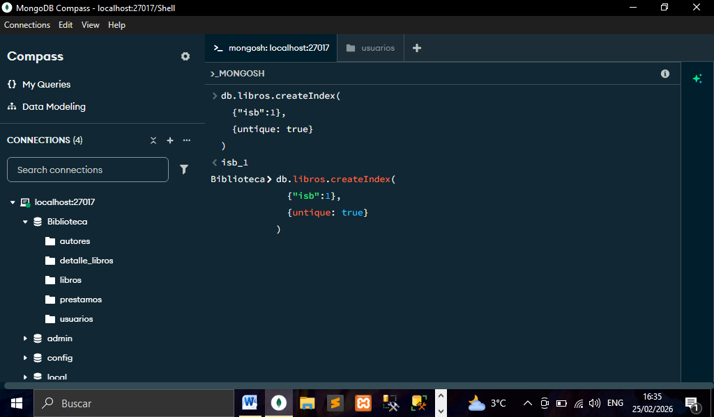

# TITULO DEL PROYECTO    

**DESARROLLANDO UNA BASE DE DATOS NoSQL DE UNA BIBLIOTECA CON MONGODB**

# DESCRIPCIÓN BREVE DEL PROYECTO (Biblioteca)
**Se realizó la implementación y el desarrollo de una base de datos para una biblioteca todo fue realizado en MongoDB, realizamos colecciones y relaciones para poder relacionar cada colección establecida, así mismo implementamos algunas herramientas y características que ofrece MongoDB como lo son operadores, proyecciones, operaciones, índices y algunas etapas que nos permiten optimizar cada una de nuestras consultas mejorando el rendimiento en nuestra base de datos, aprendimos a desarrollar bases de datos NoSQL con MongoDB ya que hoy en día es fundamental saber trabajar con bases de datos de este tipo y esencial en el desarrollo Backend moderno, a continuación una explicación más detalla parte por parte de como realizamos este proyecto.**

## ESTABLECIENDO RELACIONES Y COLECCIONES PARA NUESTRA BASE DE DATOS
**Para comenzar nuestro proyecto y empezar a crear nuestra base de datos vamos a tener que establecer relaciones y el nombre de las colecciones en MongoDB. Para eso vamos a establecer lo siguiente:**
#### COLECCIONES Y RELACIONES

- Libros y Detalle_libros(relación uno a uno).
- Usuarios y Prestamos(relación uno a muchos).
- Libros y Autores(relación muchos a muchos).
- Libros y Prestamos(relación de uno a muchos).

## VISTA PREVIA DE NUESTRA BASE DE DATOS CREADA CON SUS RESPECTIVAS COLECCIONES.
**Para nuestra base de datos y nuestras colecciones las creamos a través de una serie de comandos MongoDB como lo son el comando `mongod`,`mongo o mongosh`,`db`,`show dbs` `use`,`db.createCollections` y `show collections` entre otros  comandos puedes ver la explicación detallada de estos comando para que sirve cada uno en nuestro archivo `primerosComandosMongo.txt` de nuestro repositorio ahí lo explico a detalle cada comando**

## INSECION DE DATOS UTILIZANDO INSERTONE Y INSERTMANY
**Utilizamos las operaciones de inserción InsertOne e InsertMany para insertar documentos en nuestra base de datos ya sea uno solo o múltiples documentos para ello tenemos aquí en nuestro repositorio una carpeta llamada `INSERT` que contiene 2 archivos JavaScript:`insertOne.js` y `insertMany.js` donde tengo las inserciones de cada una de nuestras colecciones explicadas detalladamente de nuestro proyecto**
## MOSTRANDO INSERCCIONES EN NUESTRA BASE DE DATOS DE NUESTRO PROYECTO
**InsertOne en nuestra colección usuarios**

**InsertOne en nuestra colección de libros haciendo referencia con id del autor**

**InsertOne en nuestra colección autores así mismo haciendo referencia al id del libro**

**InsertOne en nuestra colección de préstamos haciendo referencia al id del libro y al id del usuario**

## MOSTRANDO INSERCCIONES MULTIPLES CON LA OPERACION INSERTMANY
**Con el insertMany podemos insertar múltiples documentos en nuestras colecciones a continuación muestro como insertamos múltiples usuarios usando esta operación de inserción:**

## OPERACIONES DE LECTURA EN NUESTRA BASE DE DATOS BIBLIOTECA CON FIND Y FIND ONE
**Después de haber insertado nuestros documentos con las operaciones de inserción podemos mostrar nuestros datos con las operaciones de lectura find y findOne y así mismo con el método `count` podemos ver la cantidad de registros que tenemos en nuestras colecciones. Así mismos en este repositorio esta una carpeta llamada `OPERACIONES-LECTURA` que contiene 1 archivo JavaScript `find.js` donde explico a detalle cómo se utiliza esta operación**

## OPERACIONES DE LECTURA APLICADAS EN NUESTRO PROYECTO DE LA BIBLIOTECA
**Utilizando la operación find para mostrar los usuarios en la base de datos**

**Ahora utilizamos el find con un filtro de búsqueda llamado query en nuestra colección libros**

**Podemos utilizar nuestra consulta con find y guardarla en una variable de tipo JavaScript y ejecutar la siguiente manera:**

**Utilizamos findOne en nuestra colección de autores para solo traer un solo documento**

**Podemos contar cuantos documentos están en nuestras colecciones con el método count**

## LIMITACION Y PAGINACION APLICADA EN NUESTRO PROYECTO
**Podemos manipular el número de documentos devueltos en una consulta para limitar resultados utilizando la operación find pero con los métodos limit y skip. Puedes ver más detalladamente las consultas con estos dos métodos en nuestra carpeta `LIMITACION-PAGINACION` viene un archivo llamado `limit&skip.js` aquí en nuestro repositorio**
**Con el método limit podemos manipular cuantos registros queremos que nos devuelva la consulta  en nuestro proyecto lo aplicamos en la colección de libros para que solo nos arrojara los primeros 3 libros**

**Con el método skip podemos omitir cierto número de documentos antes, skip se utiliza mucho en lo que es la paginación en nuestro proyecto hicimos que nos arrojara una consulta de omitir los dos primeros libros y en combinación con el método limit solo que nos traiga dos libros como se puede ver a continuación:**
*Solo nos dará como resultado 2 libros*

## USO DE LA PROYECCION Y COMPARACION CONS SUS RESPECTIVOS OPERADORES APLICADOS EN NUESTRO PROYECTO
**En MongoDB podemos hacer uso de la proyección y la comparación la proyección nos permite mostrar o proyectar ciertos campos de un documento con sus operadores($slice y /$) mientras que la comparación nos permite hacer varias comparaciones es decir estableciendo cierta condición que se cumpla muestre los documentos de nuestra base de datos gracias a los siguientes operadores 
($eq,$ne,$gt,$gte,$lt,$lte), A continuación solo mostrare un ejemplo con el operador $eq, pero puedes checar la carpeta `PROYECCION-COMPARACION` dentro tenemos un archivo `preyeccion&comparacion` donde vienen los scripts de las consultas con cada uno de los operadores mencionados cada uno con su ejemplo detallado**
#### Ejemplo de la consulta con el operador $eq donde mostraremos los libros que tengan un número de páginas igual a 464
*Resultado de la consulta*

## OPERADORES DE ARREGLOS EN MONGODB
**En nuestro proyecto realizamos consultas haciendo uso de los operadores de arreglos estos nos van a permitir realizar consultas determinadas para los arreglos dentro de nuestra base de datos haciendo uso de los siguientes operadores($elemMatch,$size,$all,$in y $nin) vamos a realizar un ejemplo que fue aplicado en nuestro proyecto haciendo uso del operador $all, como ya sabes puedes ir a la carpeta `OPERADORES-ARREGLOS` en el archivo `operadores-arreglos.js` de nuestro repositorio donde contiene todas las consultas que hicimos con estos operadores explicados detalladamente para que sirve cada uno**
**Realizamos una consulta dentro de un arreglo de autores de un libro este libro contiene 3 autores entonces haciendo uso del operador $all voy a traer ese libro pero solo con el nombre de dos autores haciendo referencia al arreglo de autores dados por su nombre**

*Obtenemos el siguiente resultado el libro que contiene esos dos autores*

## OPERADORES LOGICOS USUADOS EN NUESTRO PROYECTO
**Los operadores lógicos nos permitieron hacer consultas más específicas estableciendo ciertas condiciones estos operadores son los siguientes($and,$or,$nor y $not)**
**Solo hare un ejemplo de un operador puedes consultar la carpeta `OPERADORES-LOGICOS` con su respectivo archivo(operadores-logicos.js) donde muestro todas las consultas realizadas a la base de datos en este proyecto y con todos los operadores lógicos que existen en MongoDB**
**Operador $and utilizado en este proyecto como sabemos en el operador $and las dos condiciones establecidas deben cumplirse para que el operador funcione en esta ocasión vamos a realizar una consulta en la colección de autores y vamos a traer los autores que cumplan lo siguiente:**
- primero que la nacionalidad sea Española
- segundo que tenga fecha de nacimiento sea menor a 1900

*Resultado de esta consulta cuando las dos condiciones establecidas se cumplen*

## OPERADORES DE ELEMENTOS USADOS EN NUESTRO PROYECTO DE LA BIBLIOTECA
**Los operadores de elementos los cuales son dos $type,$exists el operador $type nos permite encontrar documentos donde tengan un tipo de datos especifico, mientras que $exist nos permite encontrar documentos donde exista un campo en especial como sabemos solo mostrar el ejemplo con el operador $type puedes encontrar los ejemplos realizados con estos dos operadores en su respectiva carpeta `OPERADORES-ELEMENTOS` dentro de su archivo `operadores-elementos.js`**
**Realizamos una consulta en el proyecto en la colección autores donde en el campo fecha_nacimiento sea de tipo date este ejemplo nos retornara todos los autores registrados en nuestra base de datos porque todos tienen ese campo con el tipo de datos `date`**
*Resultado de la consulta*

## MANEJO DE LAS ACTUALIZACIONES EN NUESTRA BASE DE DATOS DE LA BIBLIOTECA
**En Mongo tenemos 3 formas de actualizar nuestro documentos en la base de datos con updateOne podemos actualizar un solo documento en nuestra base de datos utilizamos el operador $set para actualizar veamos la siguiente actualización con updateOne**
- Cambiaremos el teléfono del usuario "Alejandra Lara"
*Aplicando updateOne en el proyecto vemos que el resultado de la consulta nos muestra que un campo  fue modificado*

**La segunda forma es utilizando la operación updateMany esta nos permite actualizar más de un documento en nuestra base de datos**
- Cambiaremos todos los libros que tienen como género "Novela Narrativa" por el género de simplemente "Novela"
*Como vemos en el resultado de la consulta vemos que modifico dos libros *

**La tercera forma de actualizar registros en MongoDB es utilizando la operación replaceOne esta operación puede actualizar documentos pero la diferencia radica en que hay que pasar todo el objeto JSON con sus propiedades es decir tenemos que escribir todo en la siguiente actualización vamos a modificar todo un libro a través de su "isbn" anteriormente su nombre era "Clean Code" lo modificamos completamente (todos los campos fueron modificados)**
*vemos que tenemos que pasar todo el objeto con sus campos así también vemos que un documento ha sido modificado*

**Puedes consultar la carpeta `UPDATE` ahí encontraras 3 archivos `replaceOne.js,updateMany.js y updateOne` donde están todas actualizaciones realizadas en este proyecto cada explicada detalladamente en los archivos**

## OPERADORES DE ACTUALIZACION APLICADOS EN EL PROYECTO
**Para poder aplicar actualizaciones más precisas en MongoDB necesitamos conocer sus operadores que nos permitirán hacer actualizaciones más específicas en la base de datos estos operadores son `$set,$unset,$inc,$min y $addToSet` cada de estos operadores cumple con una función específica a continuación solo relatare el uso de uno de ellos aplicado en el proyecto puedes consultar nuestra carpeta `OPERADORES-ACTUALIZACION` dentro contiene los cuatro archivos cada uno por su nombre del operador ahí esta detalladamente explicado cada uno y que actualización se hizo en el proyecto**
**Un operador de actualización muy usado es el operador `$inc` este operador nos permite incrementar o decrementar valores numéricos uno de las actualizaciones realizadas fue  la siguiente:**
- incrementamos el número de copias disponibles de un libro que anteriormente tenía 1 solo copia el libro fue "Cien Años De Soledad" incrementaremos el valor en 4 copias disponibles a continuación vemos como aplicamos el operador en MongoCompass
*Como solo teniamos un copia disponible pasamos el valor 3 en el operador para que se incremente en 4 copias disponibles*

*Ahora consultamos el libro para ver que si tenga las 4 copias disponibles:*

## METODOS DE ELIMINACION EN MONGODB USADOS Y APLICADOS EN NUESTRO PROYECTO
**Para eliminar documentos de nuestra base de datos utilizamos 3 métodos `deleteOne` nos permite eliminar solo un documento, `deleteMany` este nos permite eliminar múltiples documentos estableciendo un filtro dado, y finalmente  el método `remove` que se utiliza para remover documentos en la base de datos este método es obsoleto en versiones de mongo antiguas pero al igual funciona**
- delateOne: Eliminamos solo un documento de la base de datos eliminamos en la colección usuarios el usuario con nombre "Juan Ayala"
*método aplicado en el proyecto*

- delateMany: Eliminamos múltiples documentos estableciendo que coincidan con alguna condición dada vamos eliminar los usuarios que tengan como dirección "Avenida Insurgentes No#312"
*método aplicado en la base de datos Biblioteca vemos que solo elimino dos usuarios*

- remove: Este método también sirve para eliminar un solo documento de la base de datos vamos a eliminar un usuario con el nombre de Alejandra Lara
*método aplicado en el proyecto*

## RECORRIDO DE DOCUMENTOS CON JAVASCRIPT
**Podemos manipular documentos en Mongo y hacer un recorrido para poder extraer sus valores de un objeto haciendo uso del ciclo forEach de JavaScript en nuestro proyecto vamos hacer un recorrido en la colección de libros y solamente vamos a mostrar el título de todos los libros y vamos a manipular la información para que la consulta se fácil de leer para el usuario**
*Como se puede observar pudimos extraer el valor este caso el título de cada libro y nada más mostrar esa información así podemos utilizar  el ciclo forEach de JavaScript en nuestros documentos de Mongo igual tenemos la carpeta `RECORRIDO-JAVASCRIPT` donde se encuentra el archivo del ciclo forEach aquí en nuestro repositorio*

## OPTIMIZACION Y RENDIMIENTO DE LAS CONSULTAS EN NUESTRA BASE DE DATOS BIBLIOTECA USO DE PIPELINE DE AGREGACION POR ETAPAS Y SUS OPERADORES
**Para poder optimizar el rendimiento de nuestras consultas en la base datos implementamos algunas etapas de agregación con usadas mediante Pipeline de agregación que son usados como herramientas para manipular y analizar datos de forma secuencial las etapas de agregación son 3 respectivamente: `match`,`group` y `sort` que en nuestro proyecto las utilizamos. A continuación como aplicamos las etapas en nuestro proyecto de base de datos**

- Etapa match:Esta etapa nos permite filtrar documentos estableciendo una condición dada es similar al método find de MongoDB.
**En nuestro proyecto la utilizamos a filtrar los libros que tengan más de tres copias disponibles**

- Etapa Group:Esta etapa nos permite agrupar documentos a través de un campo en específico.
**En el proyecto se utilizó para hacer varias agrupaciones una de ellas consiste en agrupar los libros a través de la colección detalle_libros los agrupamos por idioma y a su vez calculamos el promedio del número de páginas aquí utilizamos el operador `$avg`, cabe señalar que existen otros operadores como lo son `$max`,`$sum` y `$min` puede encontrar otras consultas realizadas en este proyecto en nuestra carpeta `ETAPAS-AGREGACION` dentro vienen los archivos de estas tres etapas explicadas con los script de consulta especificados más ampliamente a continuación muestro solo la consulta dicha anteriormente donde se utilizó el operador del promedio**

- Etapa sort:Esta etapa nos permite ordenar documentos por uno o por más campos en específico.
**En el proyecto lo hicimos ordenando de manera alfabéticamente nuestro usuario para ordenar los usuarios de esta manera pasamos como valor el numero 1 esto le indicara a Mongo que los documentos sean ordenados de esa manera. Como se puede ver a continuación:**

## REALIZACION DE UN INFORME APLICANDO LAS 3 ETAPAS(match,group y sort) DE AGREGACION EN NUESTRO PROYECTO BASE DE DATOS BIBLIOTECA
**Elaboramos un informe de consulta a nuestra base de datos estableciendo ciertos criterios y haciendo uso de las 3 etapas de agregación también tenemos una carpeta `INFORME-3ETAPAS`,con su archivo dentro `informeCon3Etapas` donde viene explicado detalladamente la realización de este informe**
#### CARACTERISTICAS DEL INFORME
- El informe consiste primero en darnos el número total de préstamos por libro.
- ordenar resultados para ver cuál fue el libro más prestado en 2026 
- usamos match -> establecimos el campo fecha_prestamo que tiene que ser mayor o igual a 01/01/2026.
- usamos group -> para agrupar los libros dependiendo del número de préstamos aquí sumamos las veces que sea prestado cada uno de los libros.
- usamos sort -> para ordenar lo hicimos de manera descendente es decir de mayor a menor aquí nos dirá cuál es el libro más prestado y cual tiene menos prestamos en nuestra base de datos.
*Aquí muestro la consulta realizada en el proyecto con las 3 etapas de agregacion.*

*Resultado de la consulta del informe mostrando el número de veces que se prestó cada uno de los libros*

## MANEJO DE INDICES EN NUESTRO PROYECTO DE LA BASE DE DATOS BIBLIOTECA
**Para la optimización de consultas en nuestra base de datos Mongo vamos a crear índices de consultas a continuación los tipos de índices que se crearon en nuestra base de datos, también puedes verlos más detalla mente en nuestra carpeta `INDICES-MONGO` dentro vienen por archivos cada uno de los índices creados en nuestra base de datos cada uno por su nombre del índice.**

- Index Único -> Este índice garantiza que no necesitamos dos documentos con el mismo valor en un campo indexado previene la duplicación.
*Índice único aplicado a la colección de libros a través como campo único el isb*

- Índice Compuesto -> Este índice abarca más de un campo simultáneamente mejorando el rendimiento de consultas que filtran por múltiples campos.
*creamos un índice compuesto en la colección de libros relacionando con el género y el idioma del libro*

- Índice De Campo Único -> Este índice solo se crea en un solo campo que sea único.
*creamos un dice en nuestra colección de préstamos en su campo fecha_prestamo estableciendo como campo único*

- Índice De Texto -> Este índice facilita la búsqueda de texto completo en los documentos utilizando operadores de búsqueda específicos las búsquedas podemos realizarlas en un campo o conjunto de campos de tipo cadena.
*vamos a crear un índice de texto en la colección de libros en el campo título para hacer más fácil su búsqueda por su título del libro*

## MOSTRANDO LOS INDICES CREADOS ANTERIORMENTE EN MUESTRA INTERFAZ DE MONGO COMPASS

### LISTAR INDICES
*Para poder listar nuestros índices en la consola de mongo podemos utilizar el comando db.<nombre_coleccion>.getIndices*

## BORRADO DE INDICES
*Para borrar índices de la base de datos podemos aplicar el comando dopr.Index(<nombre_del_indice>), puedes checar el archivo `IndicesComandos` dentro de la misma carpeta `INDICES-MONGO`.*

### Lista De Tecnologías, Propiedades De MongoDB Como Nuestro Servidor De Base De Datos Y Herramientas Usadas En Nuestro Proyecto(Base De Datos Biblioteca)  

1. MongoDB(Servidor De Base De Datos)
2. MongoDB Compass(Interfaz Visual De Mongo) 
3. MongoDBShell(Interfaz De Línea De Comandos)
4. Visual Studio Code
5. Primeros Comandos Mongo(mongod,mongo,mongosh,etc)
6. Creación De Bases De Datos(use)
7. Manejo E Implementación de Colecciones
8. Manejo Del Formato BSON
9. Comandos Para La Manipulación De Colecciones 
10. Comandos Para Manipular Documentos
11. Tipos De Datos En MongoDB
12. Esquemas Flexibles En MongoDB
13. Patrones De Modelado En MongoDB
14. Modelo De Relaciones Uno A Uno
15. Modelo De Relaciones Uno A Muchos
16. Modelo De Relaciones Muchos A Muchos
17. Operaciones De Creación INSERT
18. Operaciones De Lectura FIND
19. Implementando De Variables JavaScript En Mongo
20. Paginación Y Limitaciones De Resultados(limit y skip)
21. Operadores De Proyección($ $slice)
22. Operadores De Comparación($eq,$ne,$gt,$gte,$lt,$lte)
23. Operadores De Arreglos($elemMatch,$size,$all,$in y $nin)
24. Operadores Lógicos($and,$or,$nor y $not)
25. Operadores De Elementos($type,$exists) 
26. Operaciones De Actualización(UPDATE Y REPLACE)
27. Operadores de Actualización($set, $unset y $inc,$min,$addToSet)
28. Operaciones De Eliminación(DELETE Y REMOVE)
29. Índices En Mongo
30. Optimización De Consultas
31. Etapas De Agregación($match,$group y $sort)
32. Operadores De Acumulación($sum,$avg,$min y $max)
33. Pipeline De Agregación
34. Recorrido De Documentos(forEach)
35. Método De Cursor(pretty())
36. Método Count En Mongo 
37. Git-Hub

### *Elaborado Por: Mario Martínez Aguilar*

