# TITULO DEL PROYECTO    

**DESARROLLANDO UNA BASE DE DATOS NoSQL DE UNA BIBLIOTECA CON MONGODB**

# DESCRIPCIÓN BREVE DEL PROYECTO (Biblioteca)
**Se realizó la implementación y el desarrollo de una base de datos para una biblioteca todo fue realizado en MongoDB, realizamos colecciones y relaciones para poder relacionar cada colección establecida, así mismo implementamos algunas herramientas y características que ofrece MongoDB como lo son operadores, proyecciones, operaciones, índices y algunas etapas que nos permiten optimizar cada una de nuestras consultas mejorando el rendimiento en nuestra base de datos, aprendimos a desarrollar bases de datos NoSQL con MongoDB ya que hoy en día es fundamental saber trabajar con bases de datos de este tipo y esencial en el desarrollo Backend moderno, a continuación una explicación más detalla parte por parte de como realizamos este proyecto.**

## ESTABLECIENDO RELACIONES Y COLECCIONES PARA NUESTRA BASE DE DATOS
**Para comenzar nuestro proyecto y empezar a crear nuestra base de datos vamos a tener que establecer relaciones y el nombre de las colecciones en MongoDB. Para eso vamos a establecer lo siguiente:**
#### COLECCIONES Y RELACIONES

- Libros y Detalle_libros(relación uno a uno).
- Usuarios y Prestamos(relación uno a muchos).
- Libros y Autores(relación muchos a muchos).
- Libros y Prestamos(relación de uno a muchos).

## VISTA PREVIA DE NUESTRA BASE DE DATOS CREADA CON SUS RESPECTIVAS COLECCIONES.
**Para nuestra base de datos y nuestras colecciones las creamos a través de una serie de comandos MongoDB como lo son el comando `mongod`,`mongo o mongosh`,`db`,`show dbs` `use`,`db.createCollections` y `show collections` entre otros  comandos puedes ver la explicación detallada de estos comando para que sirve cada uno en nuestro archivo `primerosComandosMongo.txt` de nuestro repositorio ahí lo explico a detalle cada comando**
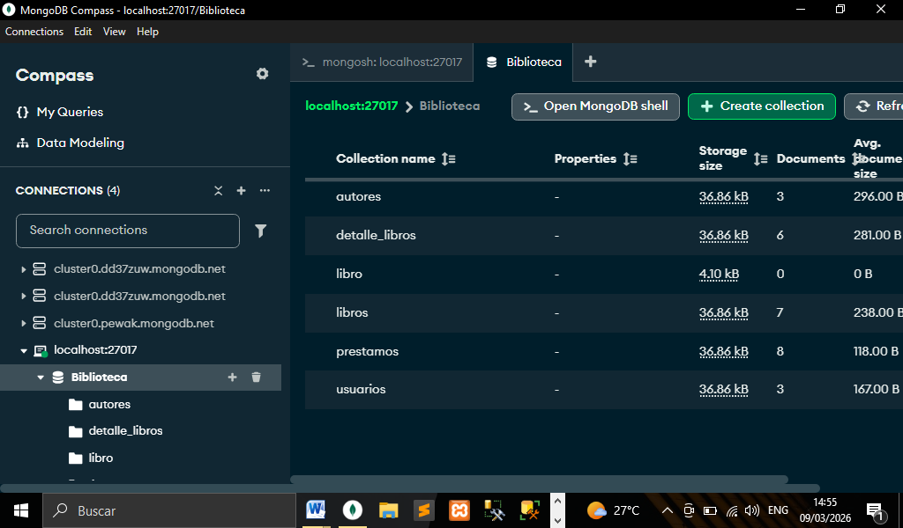

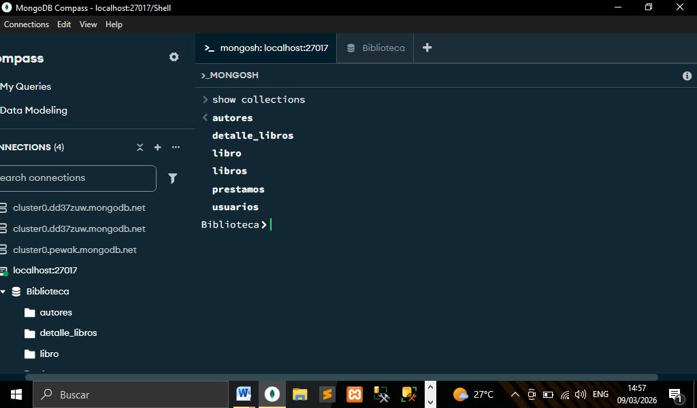

## INSERCIÓN DE DATOS UTILIZANDO INSERTONE Y INSERTMANY
**Utilizamos las operaciones de inserción InsertOne e InsertMany para insertar documentos en nuestra base de datos ya sea uno solo o múltiples documentos para ello tenemos aquí en nuestro repositorio una carpeta llamada `INSERT` que contiene 2 archivos JavaScript:`insertOne.js` y `insertMany.js` donde tengo las inserciones de cada una de nuestras colecciones explicadas detalladamente de nuestro proyecto**
## MOSTRANDO INSERCIONES EN NUESTRA BASE DE DATOS DE NUESTRO PROYECTO
**InsertOne en nuestra colección usuarios**
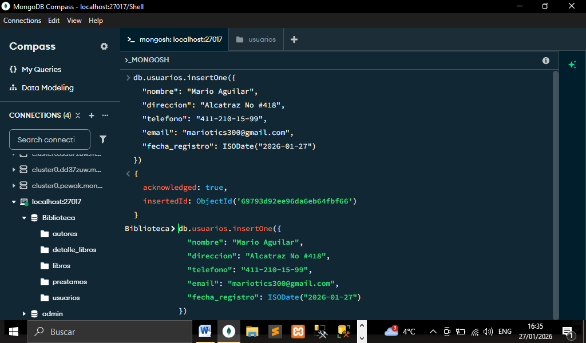
**InsertOne en nuestra colección de libros haciendo referencia con id del autor**
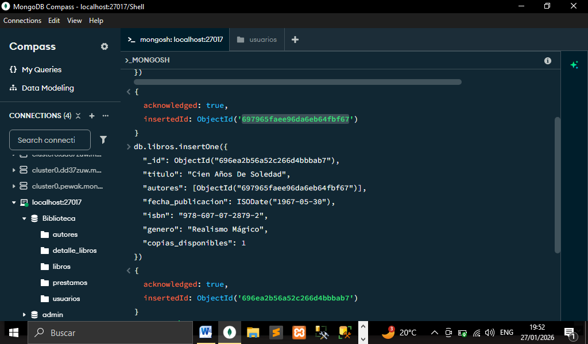
**InsertOne en nuestra colección autores así mismo haciendo referencia al id del libro**
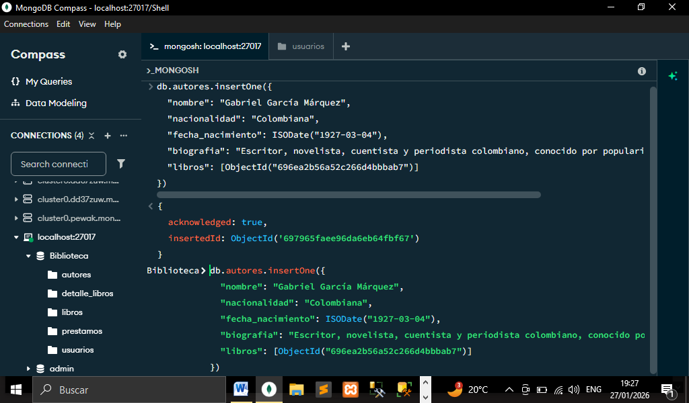
**InsertOne en nuestra colección de préstamos haciendo referencia al id del libro y al id del usuario**
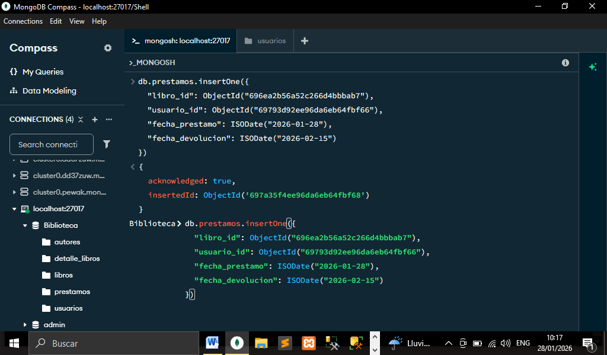

## MOSTRANDO INSERCIONES MULTIPLES CON LA OPERACIÓN INSERTMANY
**Con el insertMany podemos insertar múltiples documentos en nuestras colecciones a continuación muestro como insertamos múltiples usuarios usando esta operación de inserción:**
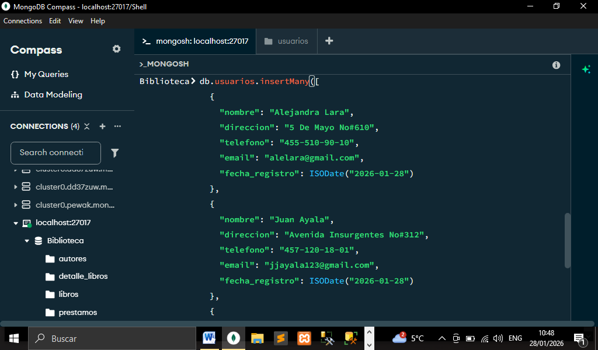
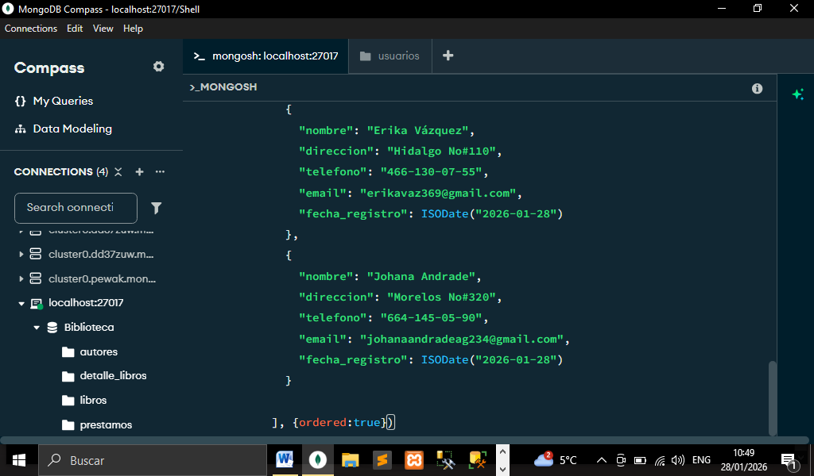

## OPERACIONES DE LECTURA EN NUESTRA BASE DE DATOS BIBLIOTECA CON FIND Y FIND ONE
**Después de haber insertado nuestros documentos con las operaciones de inserción podemos mostrar nuestros datos con las operaciones de lectura find y findOne y así mismo con el método `count` podemos ver la cantidad de registros que tenemos en nuestras colecciones. Así mismos en este repositorio esta una carpeta llamada `OPERACIONES-LECTURA` que contiene 1 archivo JavaScript `find.js` donde explico a detalle cómo se utiliza esta operación**

## OPERACIONES DE LECTURA APLICADAS EN NUESTRO PROYECTO DE LA BIBLIOTECA
**Utilizando la operación find para mostrar los usuarios en la base de datos**
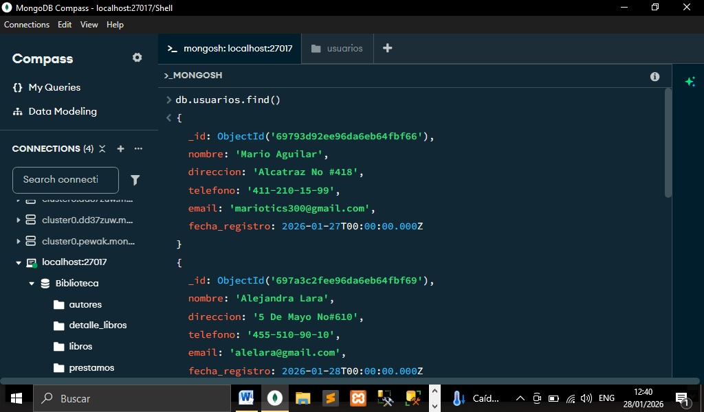
**Ahora utilizamos el find con un filtro de búsqueda llamado query en nuestra colección libros**
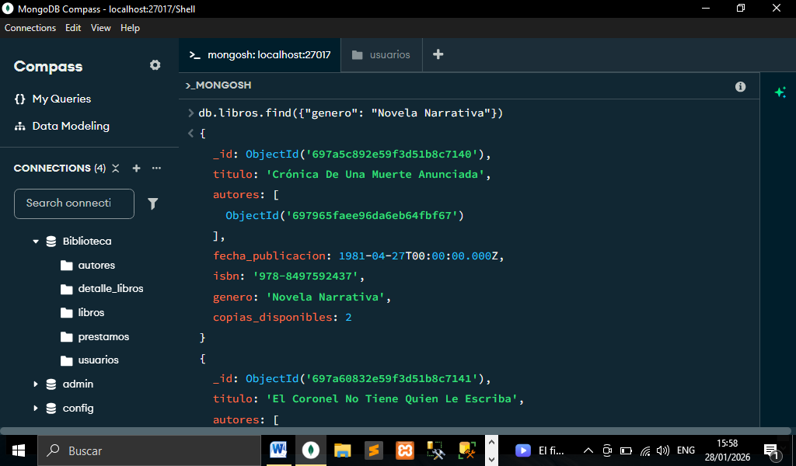
**Podemos utilizar nuestra consulta con find y guardarla en una variable de tipo JavaScript y ejecutar la siguiente manera:**
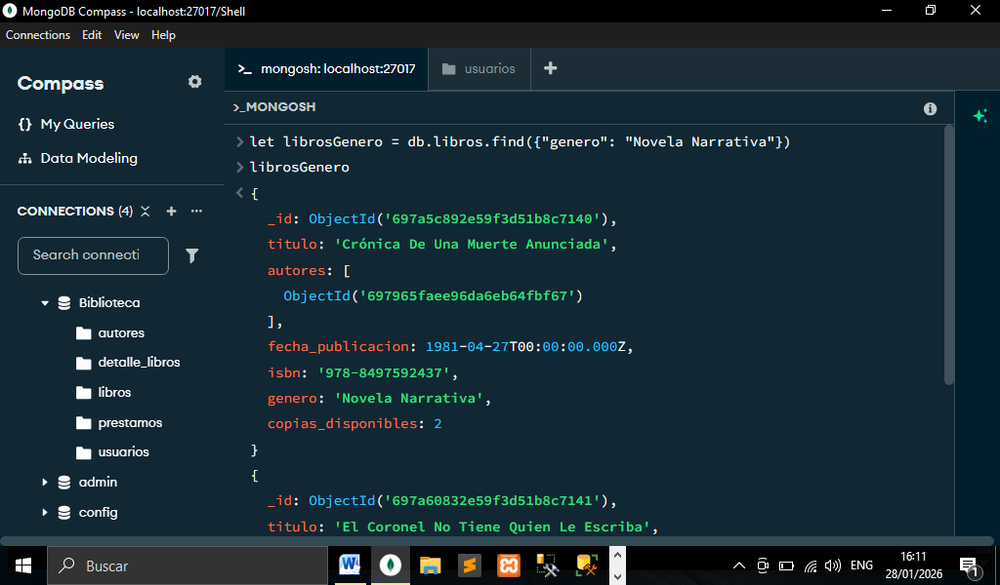
**Utilizamos findOne en nuestra colección de autores para solo traer un solo documento**
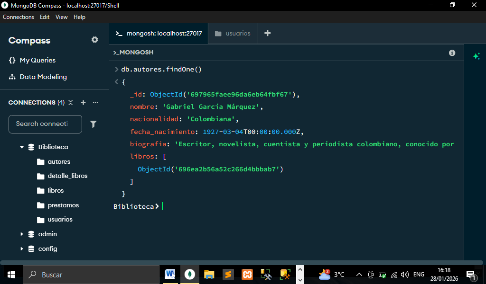
**Podemos contar cuantos documentos están en nuestras colecciones con el método count**
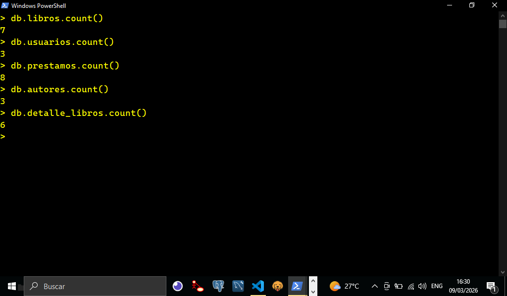

## LIMITACIÓN Y PAGINACIÓN APLICADA EN NUESTRO PROYECTO
**Podemos manipular el número de documentos devueltos en una consulta para limitar resultados utilizando la operación find pero con los métodos limit y skip. Puedes ver más detalladamente las consultas con estos dos métodos en nuestra carpeta `LIMITACIÓN-PAGINACIÓN` viene un archivo llamado `limit&skip.js` aquí en nuestro repositorio**
**Con el método limit podemos manipular cuantos registros queremos que nos devuelva la consulta  en nuestro proyecto lo aplicamos en la colección de libros para que solo nos arrojara los primeros 3 libros**
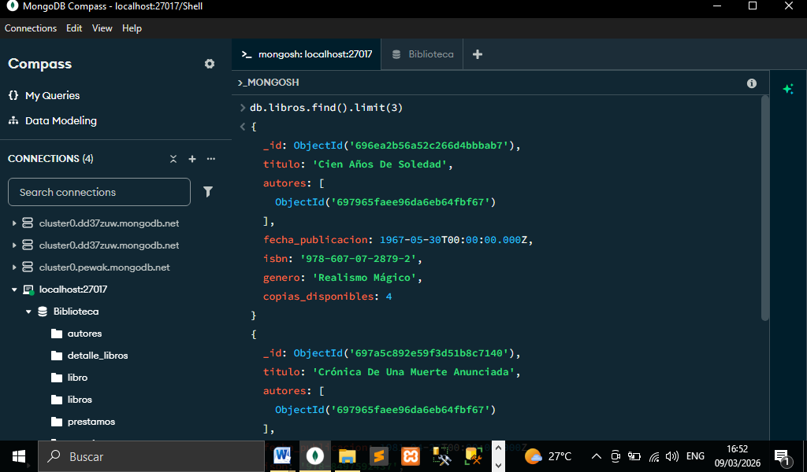
**Con el método skip podemos omitir cierto número de documentos antes, skip se utiliza mucho en lo que es la paginación en nuestro proyecto hicimos que nos arrojara una consulta de omitir los dos primeros libros y en combinación con el método limit solo que nos traiga dos libros como se puede ver a continuación:**
*Solo nos dará como resultado 2 libros*
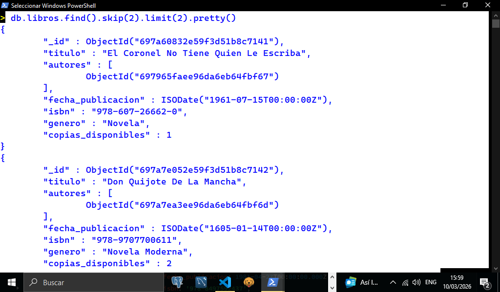

## USO DE LA PROYECCIÓN Y COMPARACIÓN CONS SUS RESPECTIVOS OPERADORES APLICADOS EN NUESTRO PROYECTO
**En MongoDB podemos hacer uso de la proyección y la comparación la proyección nos permite mostrar o proyectar ciertos campos de un documento con sus operadores($slice y /$) mientras que la comparación nos permite hacer varias comparaciones es decir estableciendo cierta condición que se cumpla muestre los documentos de nuestra base de datos gracias a los siguientes operadores 
($eq,$ne,$gt,$gte,$lt,$lte), A continuación solo mostrare un ejemplo con el operador $eq, pero puedes checar la carpeta `PROYECCIÓN-COMPARACIÓN` dentro tenemos un archivo `proyeccion&comparación` donde vienen los scripts de las consultas con cada uno de los operadores mencionados cada uno con su ejemplo detallado**
#### Ejemplo de la consulta con el operador $eq donde mostraremos los libros que tengan un número de páginas igual a 464
*Resultado de la consulta*
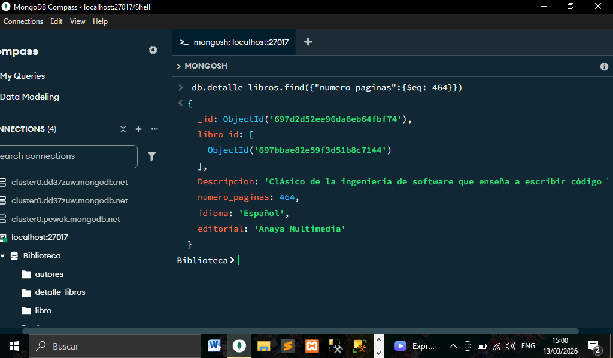

## OPERADORES DE ARREGLOS EN MONGODB
**En nuestro proyecto realizamos consultas haciendo uso de los operadores de arreglos estos nos van a permitir realizar consultas determinadas para los arreglos dentro de nuestra base de datos haciendo uso de los siguientes operadores($elemMatch,$size,$all,$in y $nin) vamos a realizar un ejemplo que fue aplicado en nuestro proyecto haciendo uso del operador $all, como ya sabes puedes ir a la carpeta `OPERADORES-ARREGLOS` en el archivo `operadores-arreglos.js` de nuestro repositorio donde contiene todas las consultas que hicimos con estos operadores explicados detalladamente para que sirve cada uno**
**Realizamos una consulta dentro de un arreglo de autores de un libro este libro contiene 3 autores entonces haciendo uso del operador $all voy a traer ese libro pero solo con el nombre de dos autores haciendo referencia al arreglo de autores dados por su nombre**

*Obtenemos el siguiente resultado el libro que contiene esos dos autores*
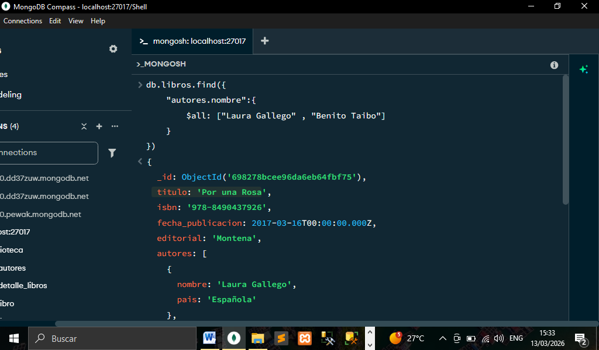

## OPERADORES LÓGICOS USADOS EN NUESTRO PROYECTO
**Los operadores lógicos nos permitieron hacer consultas más específicas estableciendo ciertas condiciones estos operadores son los siguientes($and,$or,$nor y $not)**
**Solo hare un ejemplo de un operador puedes consultar la carpeta `OPERADORES-LOGICOS` con su respectivo archivo(operadores-logicos.js) donde muestro todas las consultas realizadas a la base de datos en este proyecto y con todos los operadores lógicos que existen en MongoDB**
**Operador $and utilizado en este proyecto como sabemos en el operador $and las dos condiciones establecidas deben cumplirse para que el operador funcione en esta ocasión vamos a realizar una consulta en la colección de autores y vamos a traer los autores que cumplan lo siguiente:**
- primero que la nacionalidad sea Española
- segundo que tenga fecha de nacimiento sea menor a 1900

*Resultado de esta consulta cuando las dos condiciones establecidas se cumplen*
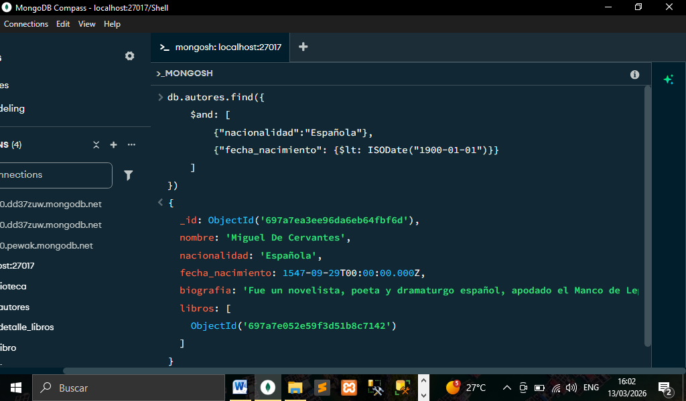

## OPERADORES DE ELEMENTOS USADOS EN NUESTRO PROYECTO DE LA BIBLIOTECA
**Los operadores de elementos los cuales son dos $type,$exists el operador $type nos permite encontrar documentos donde tengan un tipo de datos especifico, mientras que $exist nos permite encontrar documentos donde exista un campo en especial como sabemos solo mostrar el ejemplo con el operador $type puedes encontrar los ejemplos realizados con estos dos operadores en su respectiva carpeta `OPERADORES-ELEMENTOS` dentro de su archivo `operadores-elementos.js`**
**Realizamos una consulta en el proyecto en la colección autores donde en el campo fecha_nacimiento sea de tipo date este ejemplo nos retornara todos los autores registrados en nuestra base de datos porque todos tienen ese campo con el tipo de datos `date`**
*Resultado de la consulta*
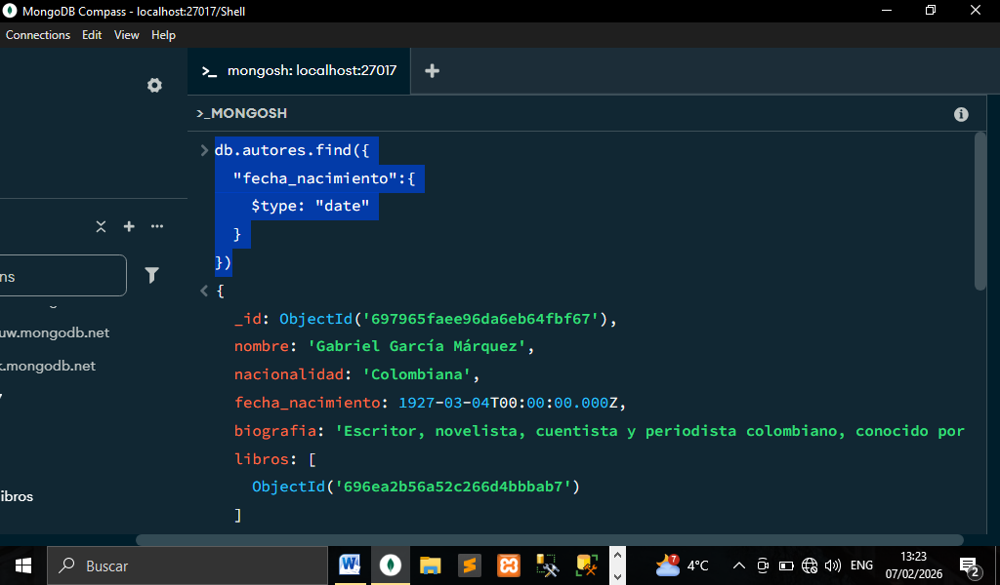
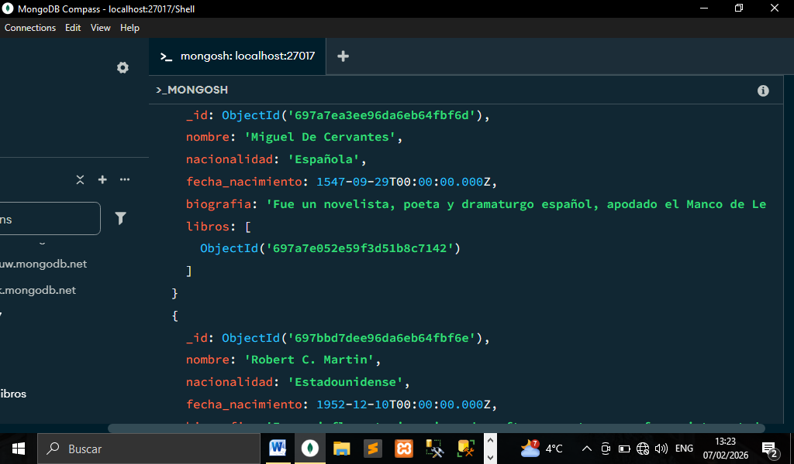

## MANEJO DE LAS ACTUALIZACIONES EN NUESTRA BASE DE DATOS DE LA BIBLIOTECA
**En Mongo tenemos 3 formas de actualizar nuestro documentos en la base de datos con updateOne podemos actualizar un solo documento en nuestra base de datos utilizamos el operador $set para actualizar veamos la siguiente actualización con updateOne**
- Cambiaremos el teléfono del usuario "Alejandra Lara"
*Aplicando updateOne en el proyecto vemos que el resultado de la consulta nos muestra que un campo  fue modificado*
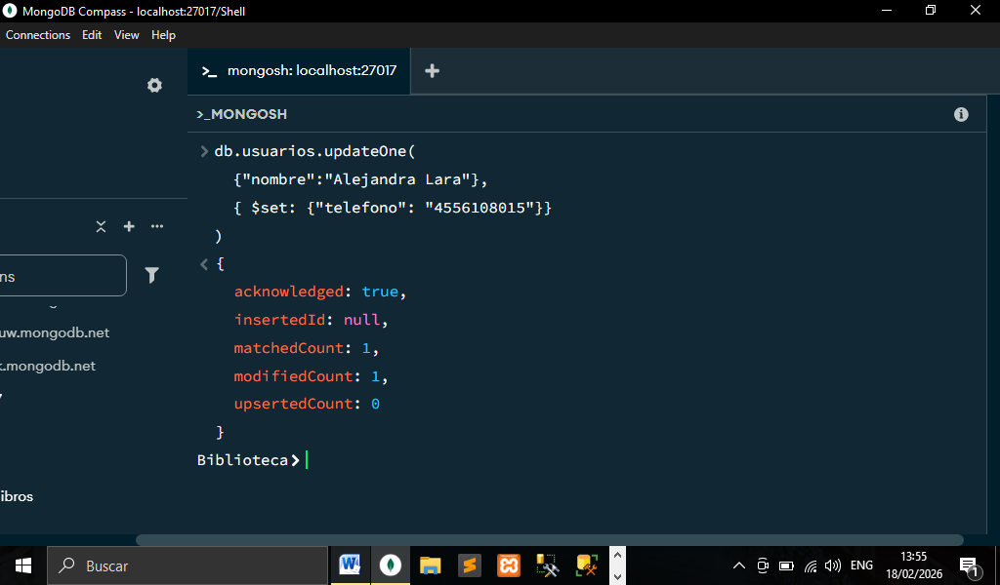
**La segunda forma es utilizando la operación updateMany esta nos permite actualizar más de un documento en nuestra base de datos**
- Cambiaremos todos los libros que tienen como género "Novela Narrativa" por el género de simplemente "Novela"
*Como vemos en el resultado de la consulta vemos que modifico dos libros *
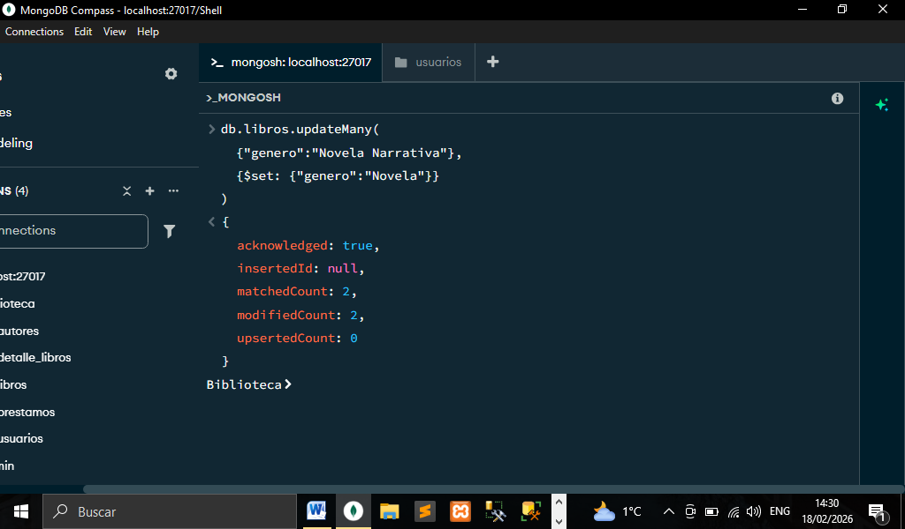
**La tercera forma de actualizar registros en MongoDB es utilizando la operación replaceOne esta operación puede actualizar documentos pero la diferencia radica en que hay que pasar todo el objeto JSON con sus propiedades es decir tenemos que escribir todo en la siguiente actualización vamos a modificar todo un libro a través de su "ISBN" anteriormente su nombre era "Clean Code" lo modificamos completamente (todos los campos fueron modificados)**
*vemos que tenemos que pasar todo el objeto con sus campos así también vemos que un documento ha sido modificado*
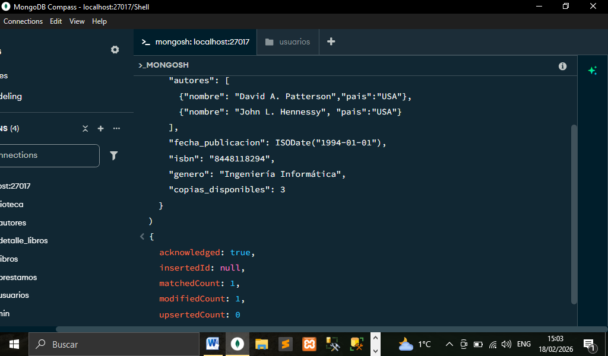
**Puedes consultar la carpeta `UPDATE` ahí encontraras 3 archivos `replaceOne.js,updateMany.js y updateOne` donde están todas actualizaciones realizadas en este proyecto cada explicada detalladamente en los archivos**

## OPERADORES DE ACTUALIZACIÓN APLICADOS EN EL PROYECTO
**Para poder aplicar actualizaciones más precisas en MongoDB necesitamos conocer sus operadores que nos permitirán hacer actualizaciones más específicas en la base de datos estos operadores son `$set,$unset,$inc,$min y $addToSet` cada de estos operadores cumple con una función específica a continuación solo relatare el uso de uno de ellos aplicado en el proyecto puedes consultar nuestra carpeta `OPERADORES-ACTUALIZACION` dentro contiene los cuatro archivos cada uno por su nombre del operador ahí esta detalladamente explicado cada uno y que actualización se hizo en el proyecto**
**Un operador de actualización muy usado es el operador `$inc` este operador nos permite incrementar o decrementar valores numéricos uno de las actualizaciones realizadas fue  la siguiente:**
- incrementamos el número de copias disponibles de un libro que anteriormente tenía 1 solo copia el libro fue "Cien Años De Soledad" incrementaremos el valor en 4 copias disponibles a continuación vemos como aplicamos el operador en MongoCompass
*Como solo teníamos un copia disponible pasamos el valor 3 en el operador para que se incremente en 4 copias disponibles*
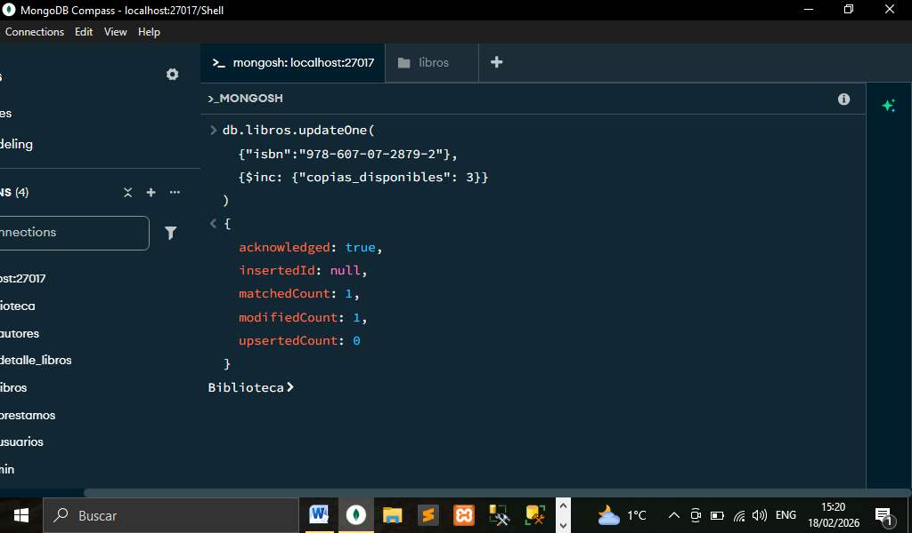
*Ahora consultamos el libro para ver que si tenga las 4 copias disponibles:*
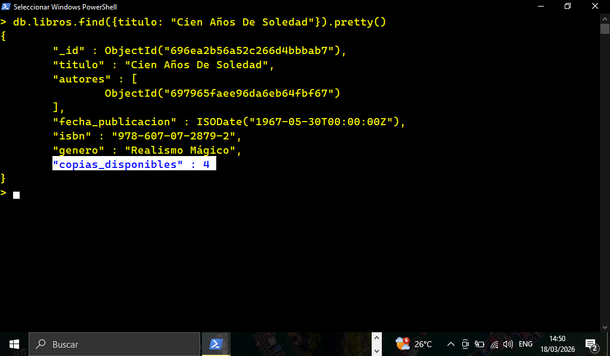

## MÉTODOS DE ELIMINACIóN EN MONGODB USADOS Y APLICADOS EN NUESTRO PROYECTO
**Para eliminar documentos de nuestra base de datos utilizamos 3 métodos `deleteOne` nos permite eliminar solo un documento, `deleteMany` este nos permite eliminar múltiples documentos estableciendo un filtro dado, y finalmente  el método `remove` que se utiliza para remover documentos en la base de datos este método es obsoleto en versiones de mongo antiguas pero al igual funciona**
- delateOne: Eliminamos solo un documento de la base de datos eliminamos en la colección usuarios el usuario con nombre "Juan Ayala"
*método aplicado en el proyecto*
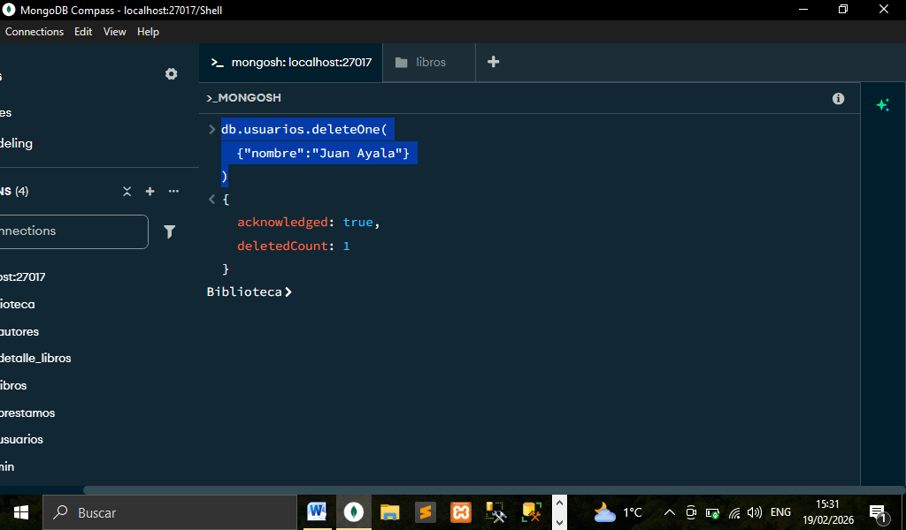

- delateMany: Eliminamos múltiples documentos estableciendo que coincidan con alguna condición dada vamos eliminar los usuarios que tengan como dirección "Avenida Insurgentes No#312"
*método aplicado en la base de datos Biblioteca vemos que solo elimino dos usuarios*
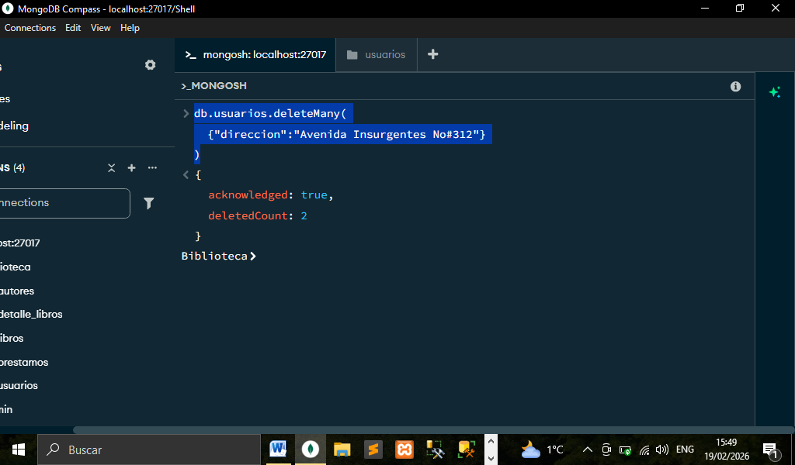

- remove: Este método también sirve para eliminar un solo documento de la base de datos vamos a eliminar un usuario con el nombre de Alejandra Lara
*método aplicado en el proyecto*
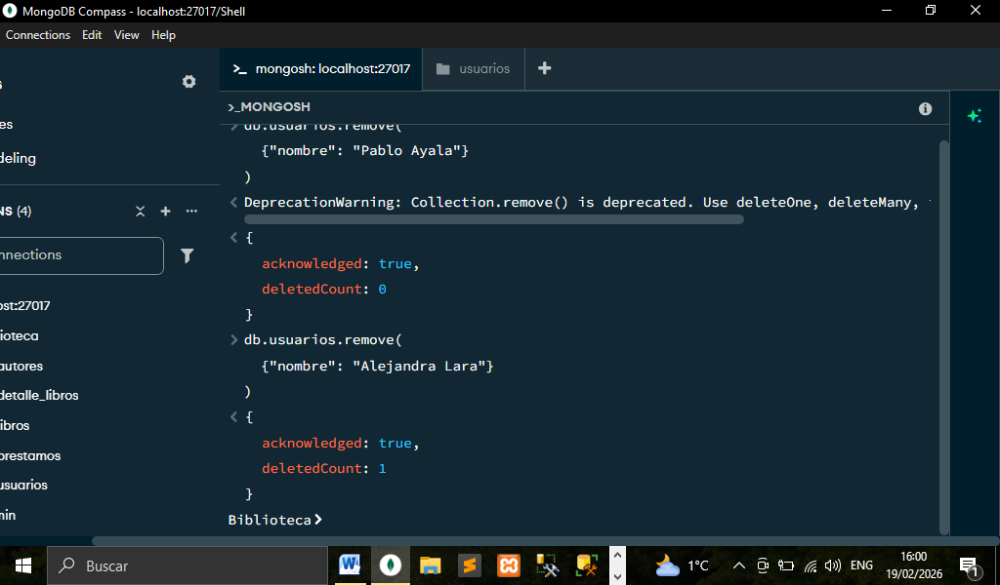

## RECORRIDO DE DOCUMENTOS CON JAVASCRIPT
**Podemos manipular documentos en Mongo y hacer un recorrido para poder extraer sus valores de un objeto haciendo uso del ciclo forEach de JavaScript en nuestro proyecto vamos hacer un recorrido en la colección de libros y solamente vamos a mostrar el título de todos los libros y vamos a manipular la información para que la consulta se fácil de leer para el usuario**
*Como se puede observar pudimos extraer el valor este caso el título de cada libro y nada más mostrar esa información así podemos utilizar  el ciclo forEach de JavaScript en nuestros documentos de Mongo igual tenemos la carpeta `RECORRIDO-JAVASCRIPT` donde se encuentra el archivo del ciclo forEach aquí en nuestro repositorio*
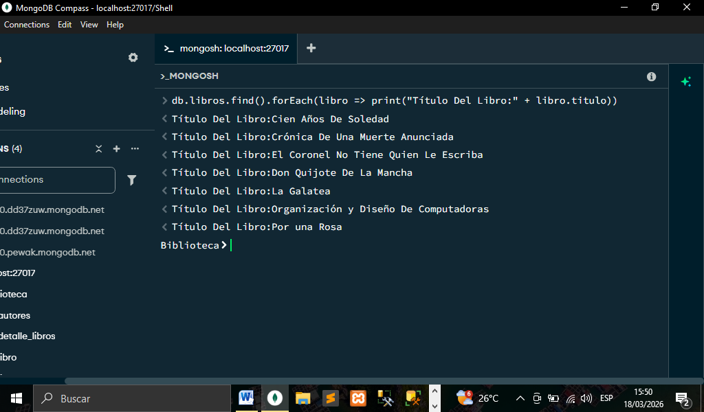

## OPTIMIZACIÓN Y RENDIMIENTO DE LAS CONSULTAS EN NUESTRA BASE DE DATOS BIBLIOTECA USO DE PIPELINE DE AGREGACIÓN POR ETAPAS Y SUS OPERADORES
**Para poder optimizar el rendimiento de nuestras consultas en la base datos implementamos algunas etapas de agregación con usadas mediante Pipeline de agregación que son usados como herramientas para manipular y analizar datos de forma secuencial las etapas de agregación son 3 respectivamente: `match`,`group` y `sort` que en nuestro proyecto las utilizamos. A continuación como aplicamos las etapas en nuestro proyecto de base de datos**

- Etapa match:Esta etapa nos permite filtrar documentos estableciendo una condición dada es similar al método find de MongoDB.
**En nuestro proyecto la utilizamos a filtrar los libros que tengan más de tres copias disponibles**
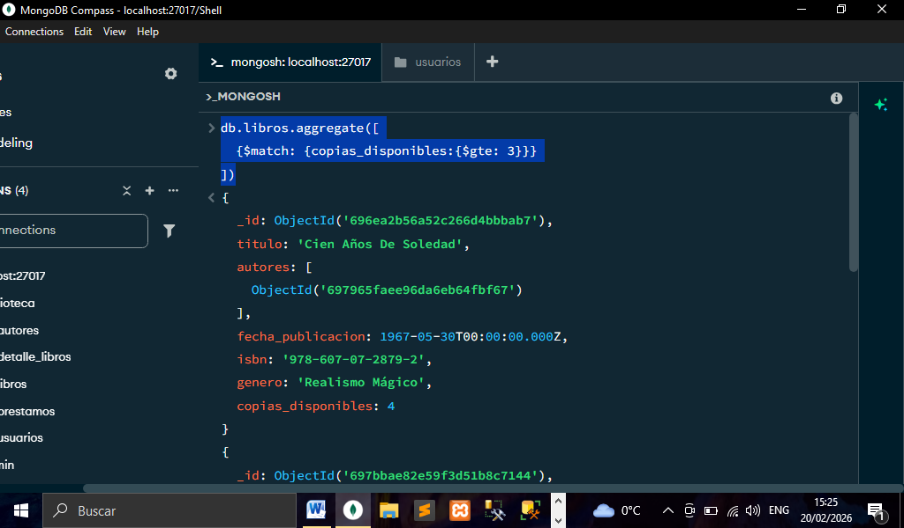
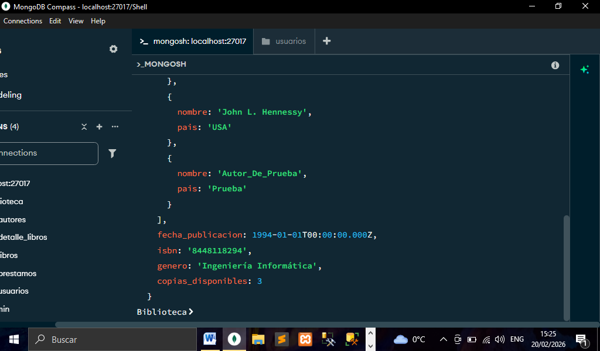

- Etapa Group:Esta etapa nos permite agrupar documentos a través de un campo en específico.
**En el proyecto se utilizó para hacer varias agrupaciones una de ellas consiste en agrupar los libros a través de la colección detalle_libros los agrupamos por idioma y a su vez calculamos el promedio del número de páginas aquí utilizamos el operador `$avg`, cabe señalar que existen otros operadores como lo son `$max`,`$sum` y `$min` puede encontrar otras consultas realizadas en este proyecto en nuestra carpeta `ETAPAS-AGREGACION` dentro vienen los archivos de estas tres etapas explicadas con los script de consulta especificados más ampliamente a continuación muestro solo la consulta dicha anteriormente donde se utilizó el operador del promedio**
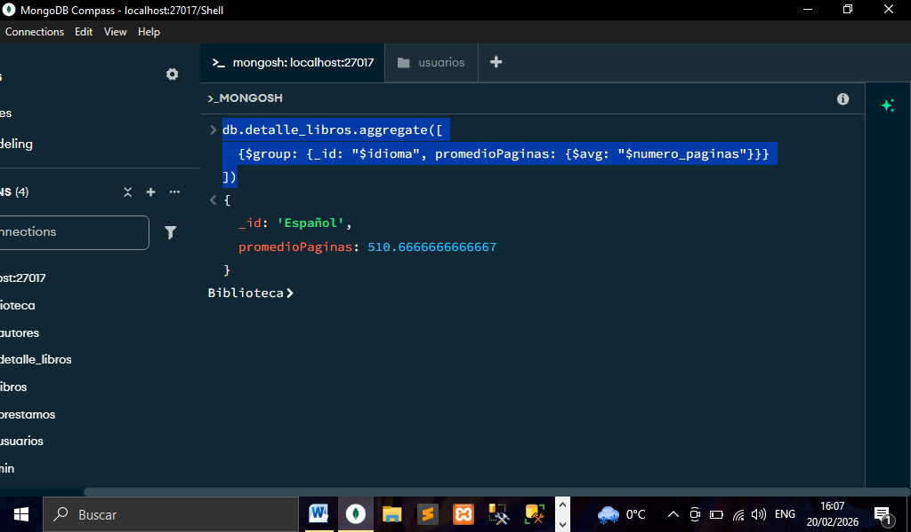

- Etapa sort:Esta etapa nos permite ordenar documentos por uno o por más campos en específico.
**En el proyecto lo hicimos ordenando de manera alfabéticamente nuestro usuario para ordenar los usuarios de esta manera pasamos como valor el numero 1 esto le indicara a Mongo que los documentos sean ordenados de esa manera. Como se puede ver a continuación:**
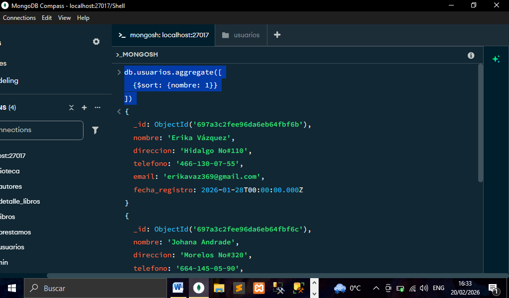

## REALIZACIÓN DE UN INFORME APLICANDO LAS 3 ETAPAS(match,group y sort) DE AGREGACION EN NUESTRO PROYECTO BASE DE DATOS BIBLIOTECA
**Elaboramos un informe de consulta a nuestra base de datos estableciendo ciertos criterios y haciendo uso de las 3 etapas de agregación también tenemos una carpeta `INFORME-3ETAPAS`,con su archivo dentro `informeCon3Etapas` donde viene explicado detalladamente la realización de este informe**
#### CARACTERÍSTICAS DEL INFORME
- El informe consiste primero en darnos el número total de préstamos por libro.
- ordenar resultados para ver cuál fue el libro más prestado en 2026 
- usamos match -> establecimos el campo fecha_prestamo que tiene que ser mayor o igual a 01/01/2026.
- usamos group -> para agrupar los libros dependiendo del número de préstamos aquí sumamos las veces que sea prestado cada uno de los libros.
- usamos sort -> para ordenar lo hicimos de manera descendente es decir de mayor a menor aquí nos dirá cuál es el libro más prestado y cual tiene menos prestamos en nuestra base de datos.
*Aquí muestro la consulta realizada en el proyecto con las 3 etapas de agregación.*
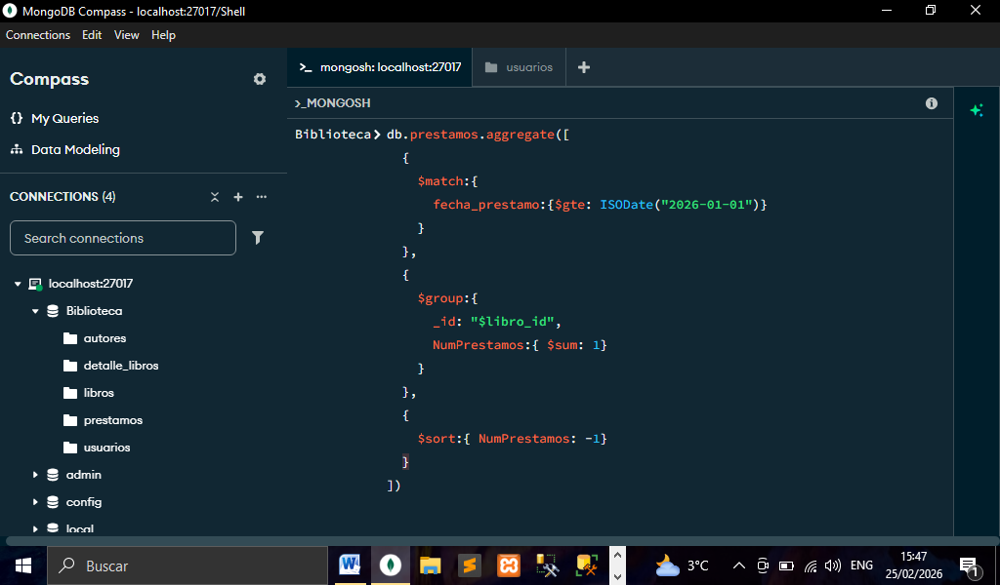
*Resultado de la consulta del informe mostrando el número de veces que se prestó cada uno de los libros*
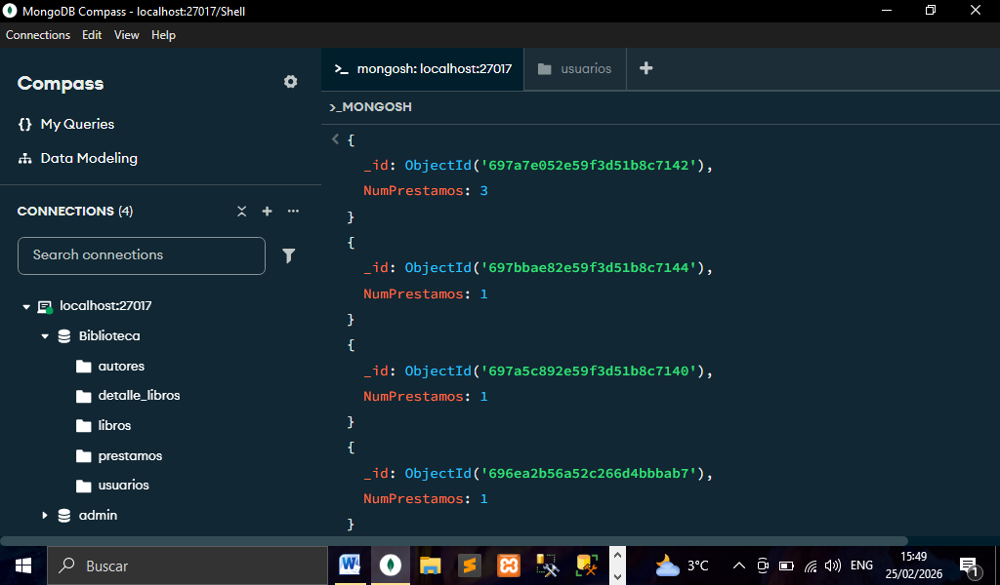

## MANEJO DE INDICES EN NUESTRO PROYECTO DE LA BASE DE DATOS BIBLIOTECA
**Para la optimización de consultas en nuestra base de datos Mongo vamos a crear índices de consultas a continuación los tipos de índices que se crearon en nuestra base de datos, también puedes verlos más detalla mente en nuestra carpeta `INDICES-MONGO` dentro vienen por archivos cada uno de los índices creados en nuestra base de datos cada uno por su nombre del índice.**

- Index Único -> Este índice garantiza que no necesitamos dos documentos con el mismo valor en un campo indexado previene la duplicación.
*Índice único aplicado a la colección de libros a través como campo único el isbn*
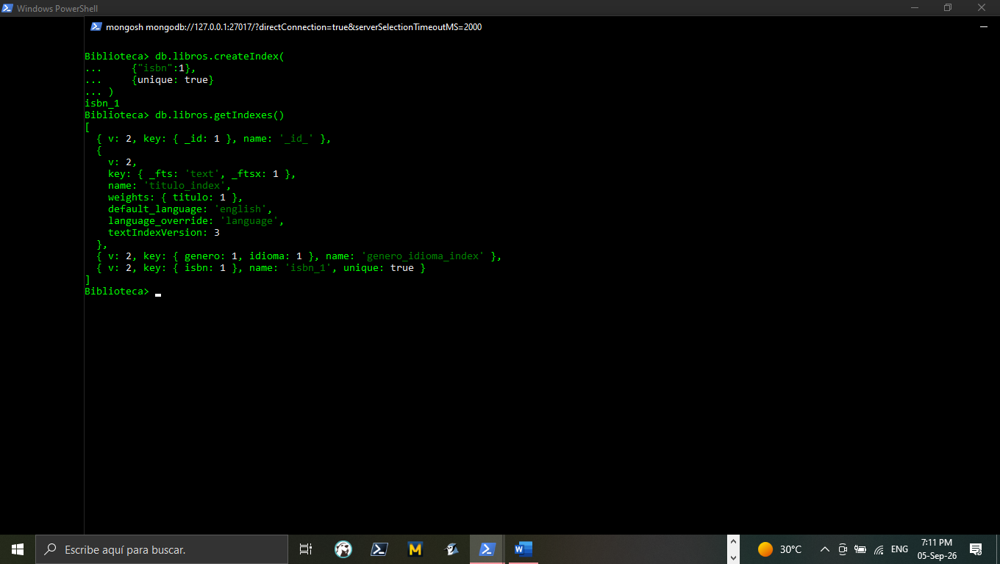

- Índice Compuesto -> Este índice abarca más de un campo simultáneamente mejorando el rendimiento de consultas que filtran por múltiples campos.
*creamos un índice compuesto en la colección de libros relacionando con el género y el idioma del libro*
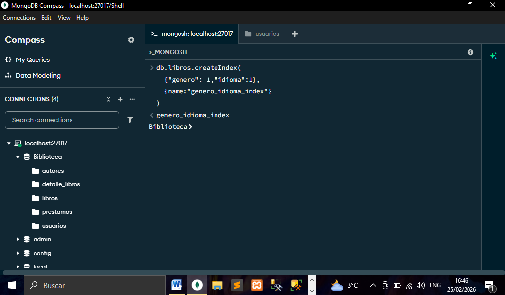

- Índice De Campo Único -> Este índice solo se crea en un solo campo que sea único.
*creamos un dice en nuestra colección de préstamos en su campo fecha_prestamo estableciendo como campo único*
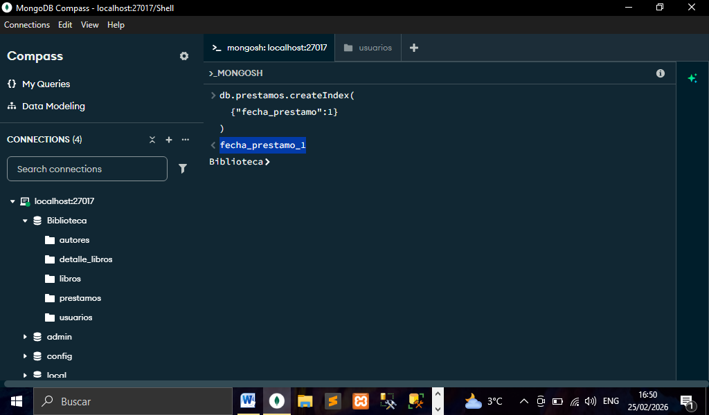

- Índice De Texto -> Este índice facilita la búsqueda de texto completo en los documentos utilizando operadores de búsqueda específicos las búsquedas podemos realizarlas en un campo o conjunto de campos de tipo cadena.
*vamos a crear un índice de texto en la colección de libros en el campo título para hacer más fácil su búsqueda por su título del libro*
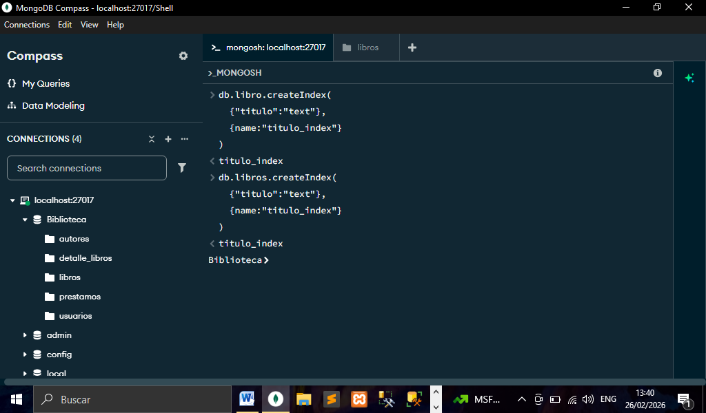

## MOSTRANDO LOS INDICES CREADOS ANTERIORMENTE EN MUESTRA INTERFAZ DE MONGO COMPASS
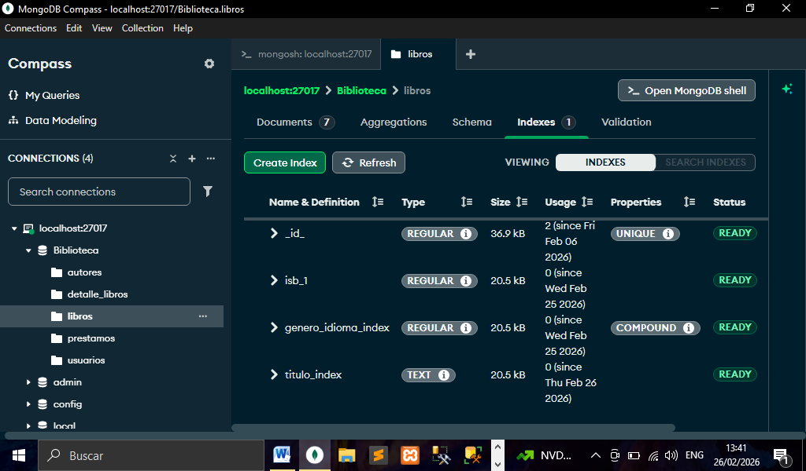
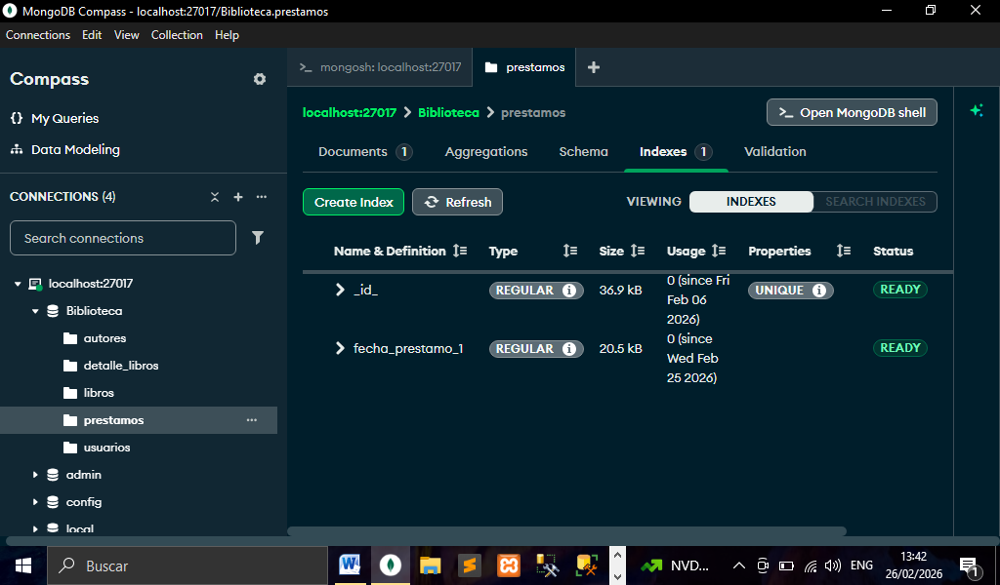

### LISTAR INDICES
*Para poder listar nuestros índices en la consola de mongo podemos utilizar el comando db.<nombre_coleccion>.getIndices*
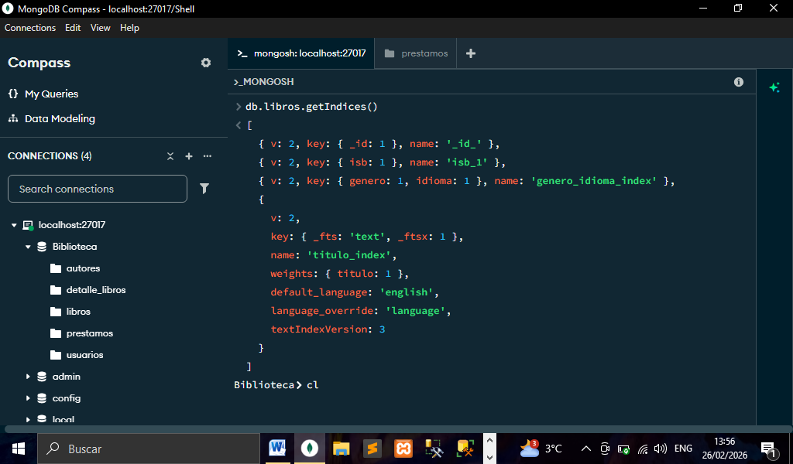

## BORRADO DE INDICES
*Para borrar índices de la base de datos podemos aplicar el comando drop.Index(<nombre_del_indice>), puedes checar el archivo `IndicesComandos` dentro de la misma carpeta `INDICES-MONGO`.*
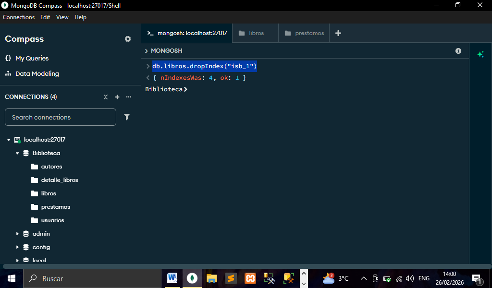

## APLICANDO INDICE DE TEXTO EN LA BASE DE DATOS MONGODB
**Ahora vamos a realizar varios tipos de búsquedas para aplicar este tipo de índice he creado una carpeta llamada `APLICANDO-INDICES` dentro un archivo javaScript con el nombre de `Aplicando-indice-texto` donde contiene todos los script para realizar las todas la búsquedas que iré mencionando**

1. Búsqueda Básica
**Esta búsqueda nos permite traer los libros por su nombre usando el operador $text y el operador $search en el archivo `aplicando-indice-texto` explico detalladamente este tipo de búsqueda puedes consultarlo, a continuación la ejecución de nuestra búsqueda en la base de datos, traemos el libro por su nombre:**
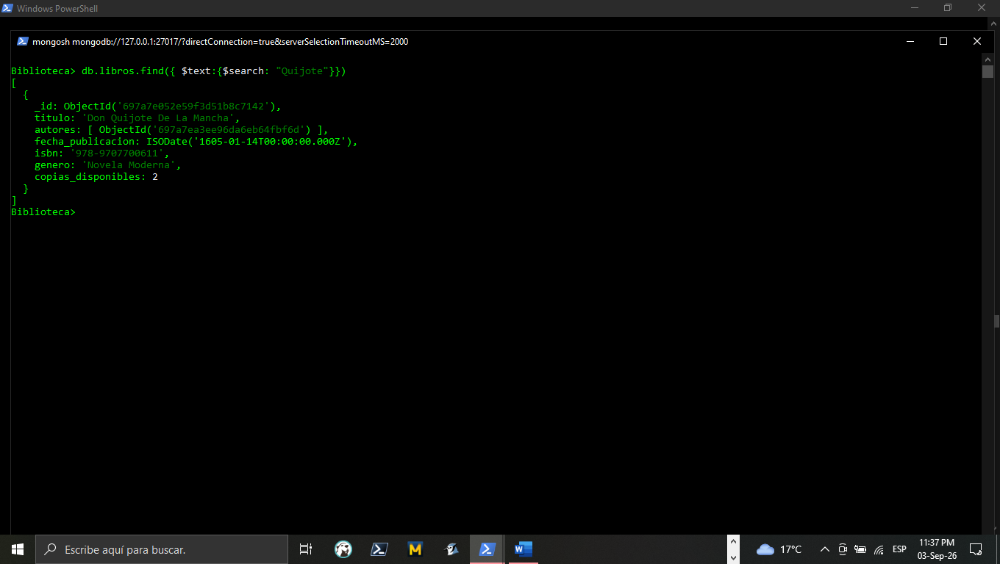

2. Búsqueda de frases exactas
**Este tipo de búsqueda nos permite buscar por una frase exacta, aplicando nuestro indice de texto y usando una sintaxis especial que explico en el archivo `aplicando-indice-texto`, esta búsqueda nos va permitir traer los libros por una frase exacta con respecto al nombre del libro como se puede apreciar a continuación la búsqueda por frases exactas en la base de datos:**
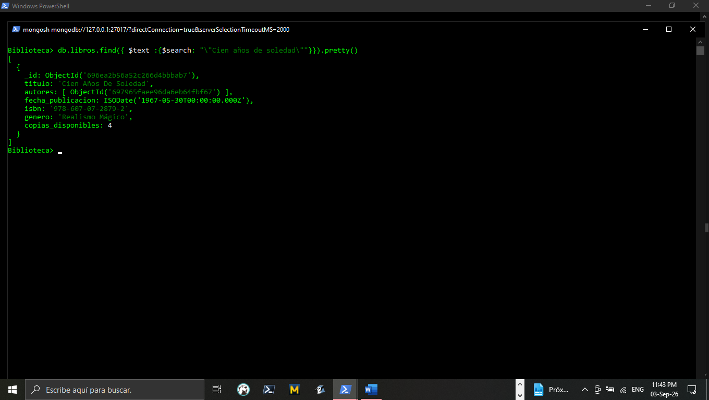

3. Búsqueda para excluir palabras especificas
**Este tipo de búsquedas nos permite excluir palabras a la hora de realizar una búsqueda, en nuestro caso la consulta no devuelve nada ya que colocamos una palabra relacionada con el nombre del libro como se puede apreciar a continuación:**
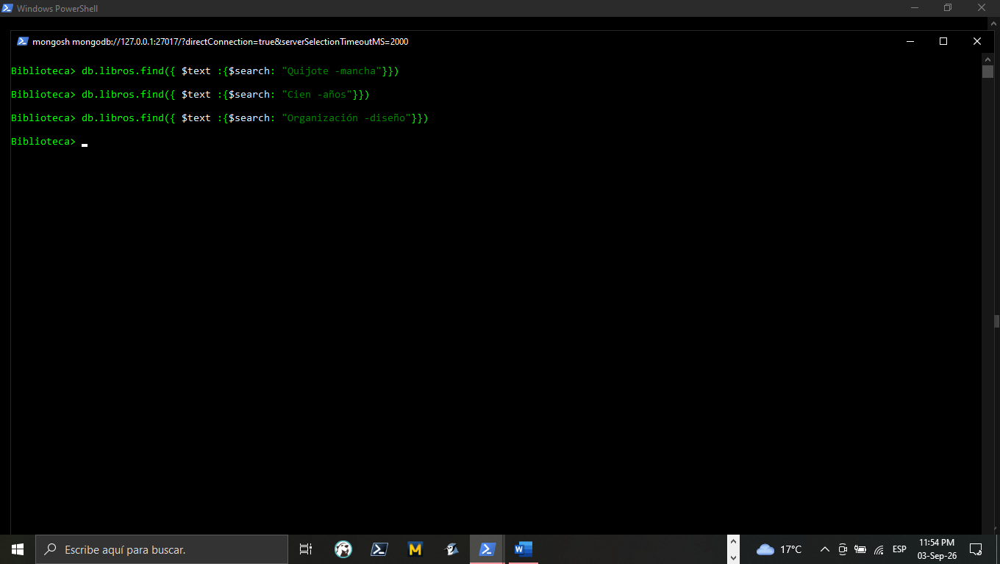

4. Búsqueda por relevancia y puntuación /Score
**Esta búsqueda nos permite traer los libros por relevancia cuando colocamos una palabra usando `textScore` para ver la puntuación de relevancia que tiene esa palabra en el título del libro acompañado del operador `$meta` en mi archivo `Aplicando-indice-texto` ahi explico a detalle como realize este tipo de búsqueda en la base de datos, a continuación ejecutando la búsqueda por relevancia así como su puntuación:**
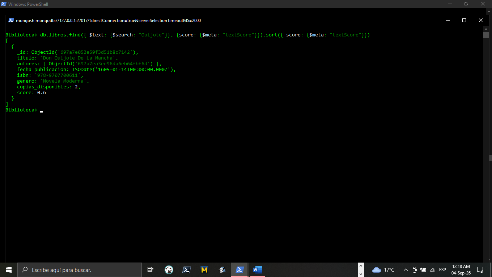

## APLICANDO INDICE DE TIPO ÚNICO EN LA BASE DE DATOS MONGODB
**Este tipo de índice sirve para evitar documentos duplicados en la base de datos, en nuestro caso creamos índice en la colección de libros aplicándolo en el campo `isbn` para evitar que se insertaran libros con el mismo isbn ya que eso no puede ser posible, ademas manejamos el error a través de código JavaScript con un `try y catch`, a continuación mostrare como llevamos la aplicación de este índice puedes consultar el código del script en nuestra archivo que creamos llamado `Aplicando-indice-unico.js` donde explico mas a detalle todo el proceso**

**Mostrando error de  duplicado cuando tratamos de insertar un libro con el mismo isbn:**
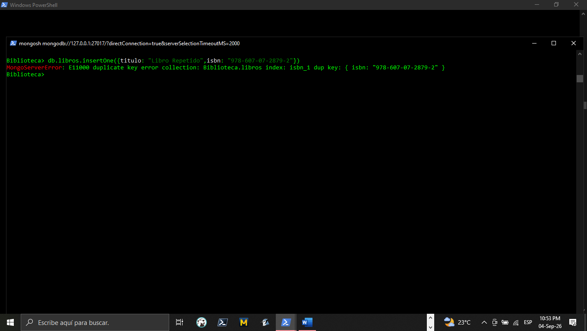

**Manejando el error con try y catch vemos como aplicamos el código para manejar estos tipos de errores(11000) en nuestra base de datos:**
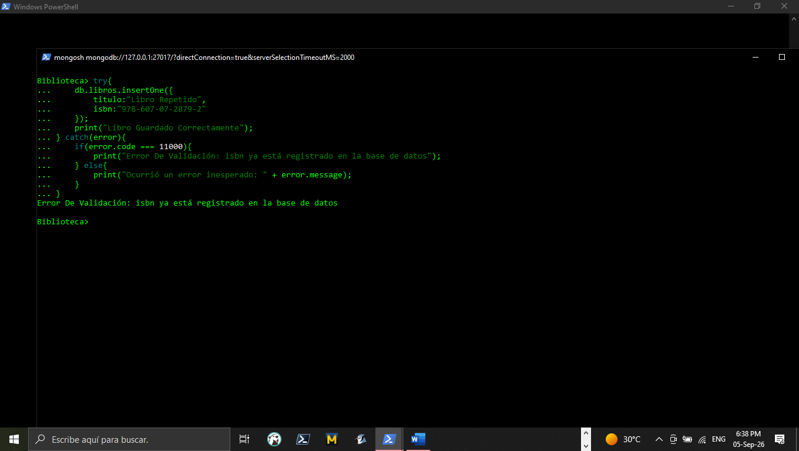

**Ahora vemos como podemos insertar el libro con otro isbn que no exista en la base de datos:**
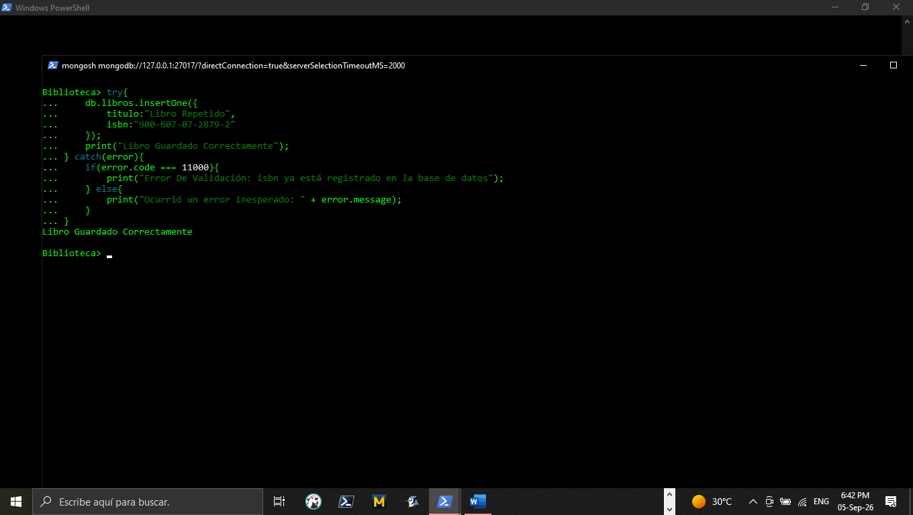

**Como último paso verificamos que el libro este realmente en nuestra colección de libros:**
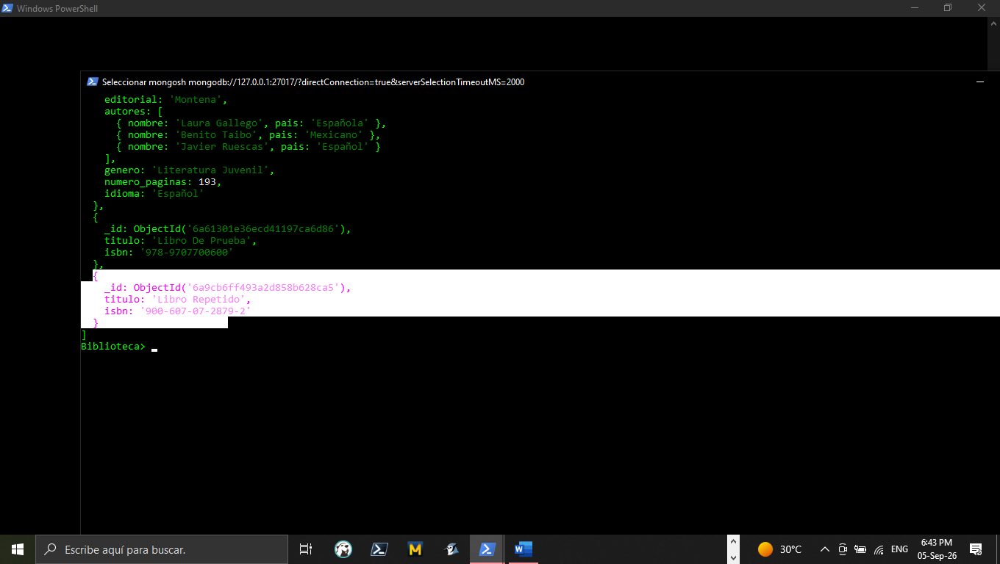

## APLICANDO INDICE DE TIPO CAMPO ÚNICO EN LA BASE DE DATOS MONGODB
**Para aplicar este índice vamos a realizar la consulta primero que consiste en analizar los documentos que cumplan con la condición que es traer todos prestamos de los libros que se hicieron a partir de la fecha 2026-01-28 es decir todos los prestamos de lo que va del 2026, aquí ya usaremos en comando distinto que es explain("executionStats") lo interesante es que veremos la optimización de esta consulta a partir de la creación y aplicación del índice de campo único como otras propiedades avanzadas que podemos ver con este comando**

**Vamos a usar explain para analizar el ParsedQuery que nos dirá a que campo de la colección se le estará aplicando la condición establecida, puedes checar mi archivo `Aplicando-indice-campo-unico.js` ,donde explico mas detalladamente que podemos analizar cuando ejecutamos este comando a continuación vemos como aplicamos explain en mongodb para analizar el ParsedQuery:**
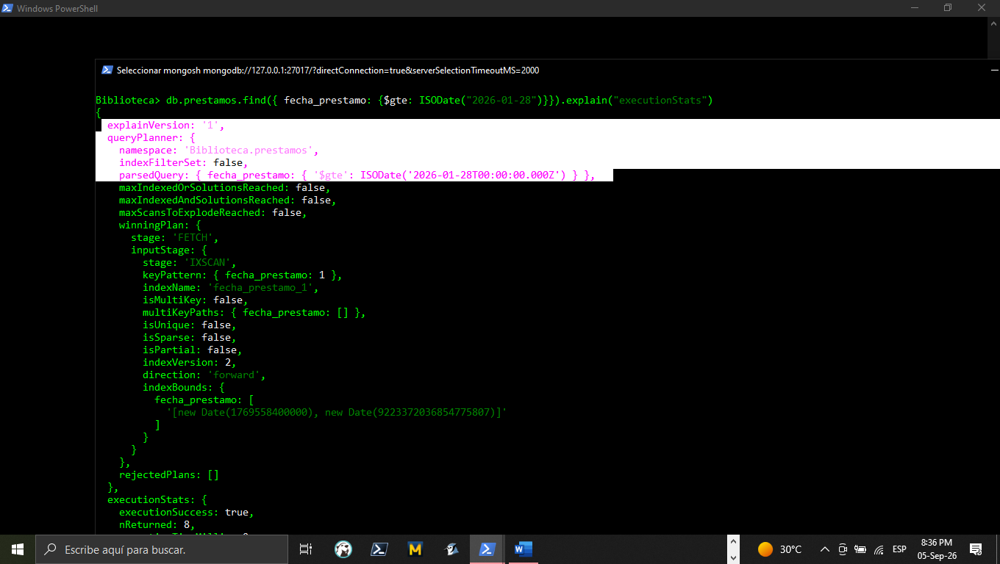

**Ahora vamos analizar que se este aplicando el índice de campo único a través del IXSCAN se encuentra en el apartado winningPlan:**
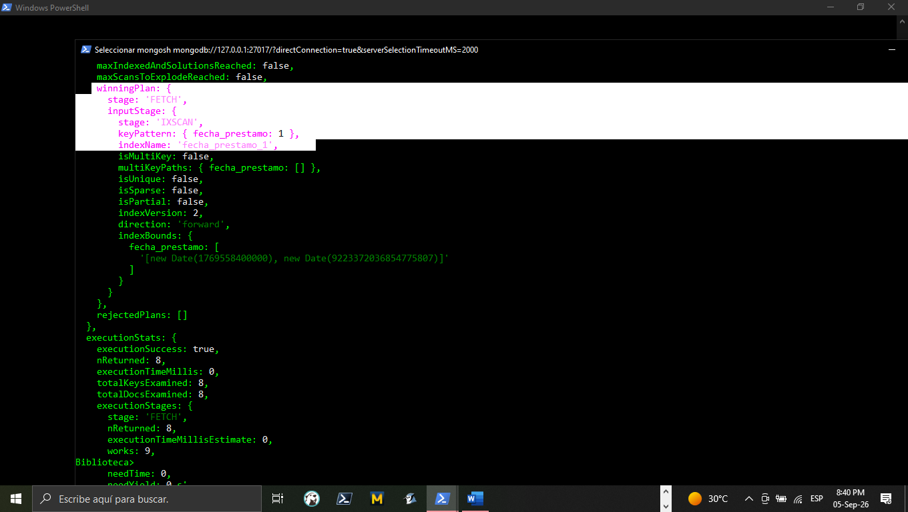 

**Analizando con la propiedad de mongodb executionStats ver la cantidad de documentos encontrados a partir de nuestra condición que se estableció los prestamos de los libros a partir de esa fecha:**
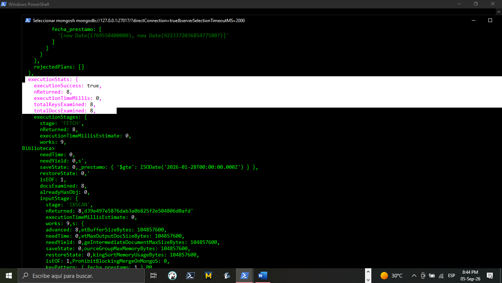

**Podemos ver también el filtro que se aplica y a que base de datos se está aplicando la consulta todo esto en el apartado command, como se ve a continuación:**
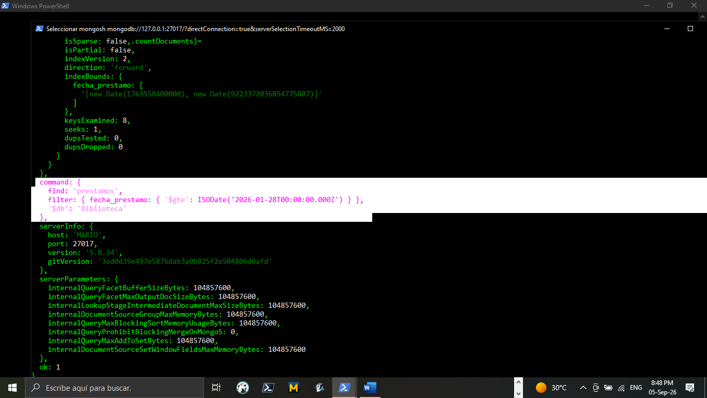

**Por último podemos ver la información del servidor como en que puerto y host se esta ejecutando MongoDB, además la versión con la que se esta trabajando todo esto en el apartado serverInfo:**
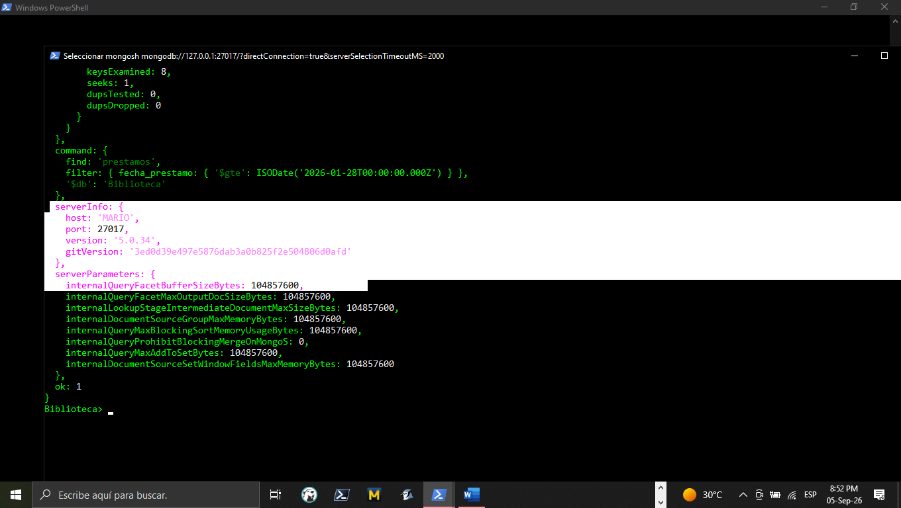

## APLICANDO INDICE COMPUESTO EN LA BASE DE DATOS MONGODB
**Aplicamos nuestro indice compuesto ya que fue creado en la colección de libros en los campos género e idioma, podemos realizar búsquedas pasado los dos campos como se muestra a continuación:**
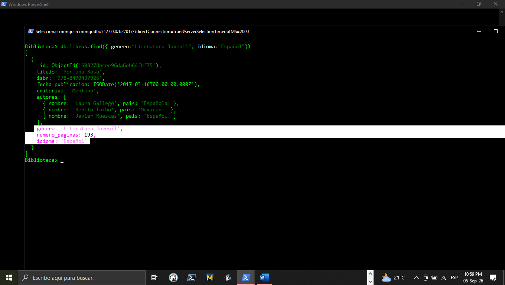

**Ahora también el índice funciona si solo pasamos un solo campo es este caso buscamos por género nada mas:**
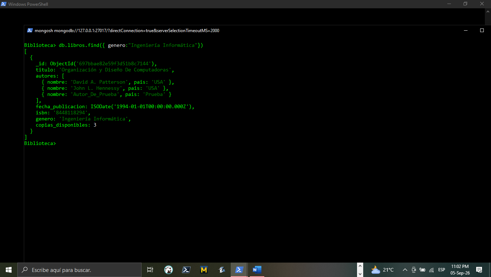

**Analizamos que el índice se estuviera aplicando con explain,recordamos que podemos encontrar los scripts de este índice en al archivo llamado `Aplicando-indice-compuesto` dentro de su carpeta `APLICANDO-INDICES`:**
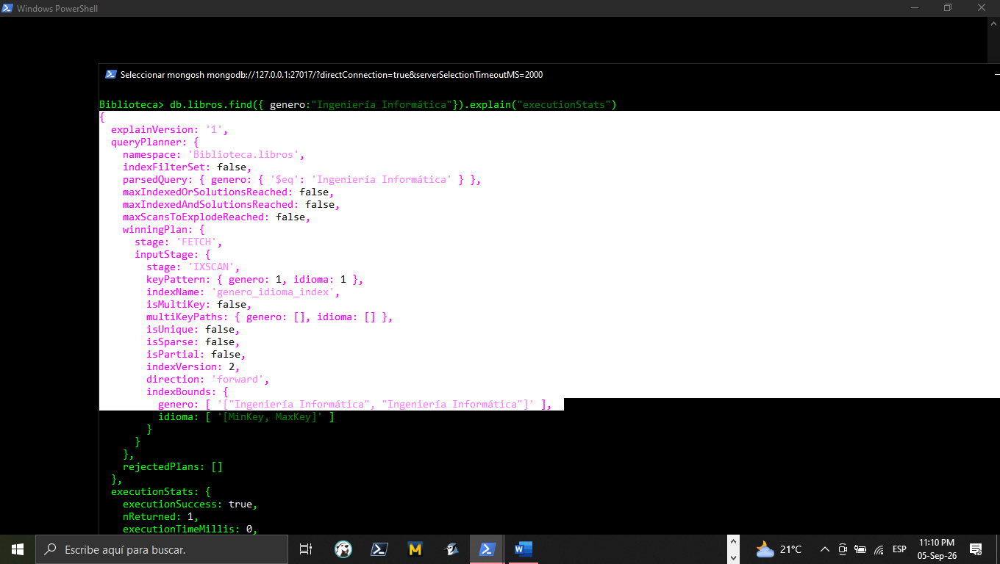

## 💾 Gestión de Respaldos y Restauración (Backups & Restore)
**En esta sección se detallan los dos métodos implementados para asegurar la integridad de los datos de nuestra base de datos de la biblioteca: un respaldo físico local y un respaldo  en la nube.**

### MÉTODO 1: Respaldo Físico (Unidad de Almacenamiento Externa / USB) 💽
**Este proceso exporta los datos de la aplicación en archivos BSON/JSON para poder moverlos y resguardarlos en un dispositivo físico.**

#### Pasos para realizar el respaldo:

1. Conecta tu unidad de almacenamiento física a la computadora.
2. Abre la consola y ejecuta el siguiente comando apuntando a la ruta de tu disco externo:

```bash
   mongodump --db nombre_de_tu_base_de_datos --out "D:\Ruta_De_Tu_Unidad_Fisica\Backups"
 ```
*(Cambia `D:` por la letra que tenga asignada tu unidad física y `nombre_de_tu_base_de_datos` por la tuya).*

#### Aquí ejecutamos el comando mongodump para realizar el respaldo físico
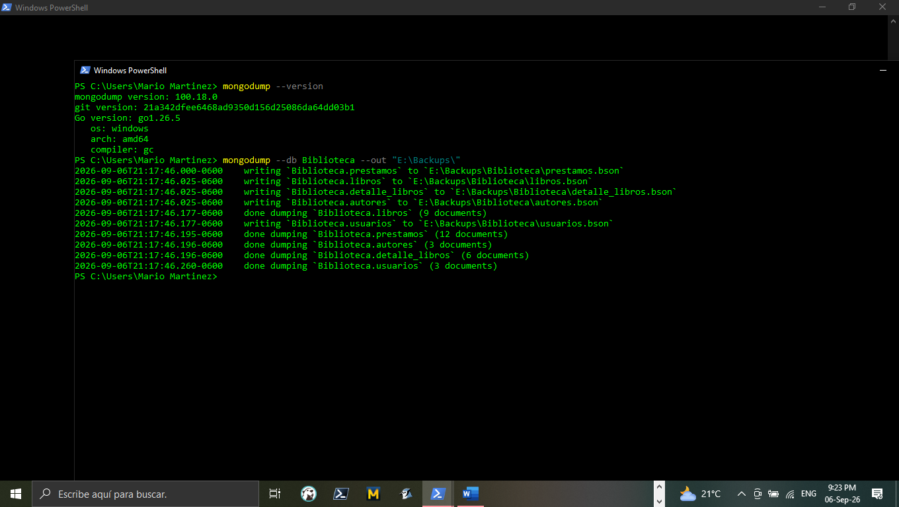

#### Vemos que nuestro respaldo se creo en la memoria podemos observar los archivos JSON Y BSON de nuestra base de datos de la Biblioteca
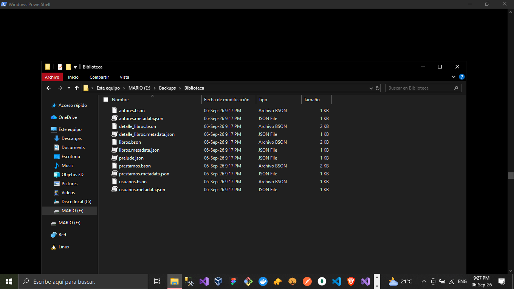

#### Ahora hacemos una prueba definitiva borramos nuestra base de datos actual para después hacer la restauración
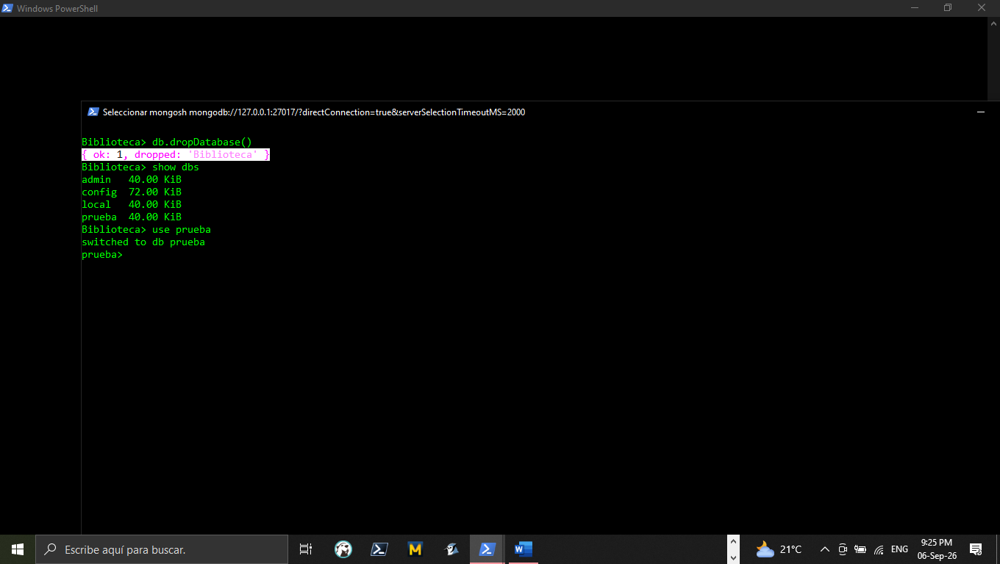

#### Pasos para la Restauración:

1. Asegúrate de tener conectada la unidad con el respaldo.
2. Ejecuta el comando apuntando a la carpeta de la base de datos respaldada:
```bash
   mongorestore --db nombre_de_tu_base_de_datos "D:\Ruta_De_Tu_Unidad_Fisica\Backups\nombre_de_tu_base_de_datos"
```
#### Ejecutamos el comando mongorestore para hacer nuestra restauración de la base de datos como se observa a continuación
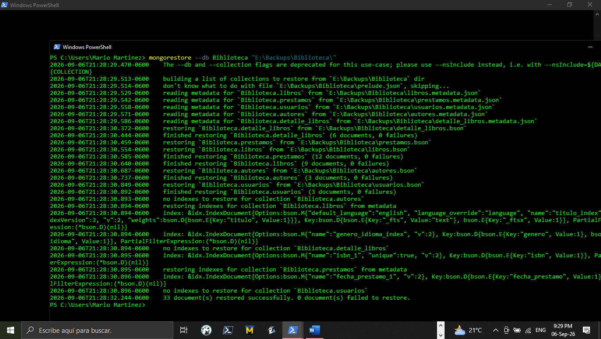

#### Finalmente comprobamos que nuestra base de datos vuelve estar en el servidor con toda nuestra información respaldada
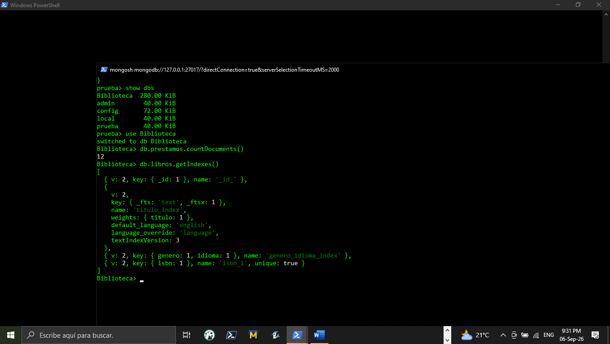

### MÉTODO 2: Respaldo en la Nube (Backblaze B2) ☁️
**Este proceso describe cómo configurar el almacenamiento en la nube desde cero, habilitar la consola globalmente y subir las copias de seguridad comprimidas en formato `.gz` para tener redundancia y protección ante fallos de hardware.**

#### 🛠️ 1. Configuración Inicial en la Web de Backblaze:
* **Crear el Bucket:** Inicia sesión en Backblaze, ve a **B2 Cloud Storage > Buckets**, haz clic en **Create a Bucket**, asígnale el nombre `Biblioteca-Mongo`, configúralo como *Private* (Privado) y créalo.

**Aquí vemos a continuación como creamos el bucket y le asignamos un nombre para mi caso fue `Biblioteca-Mongo` y de manera privada:**
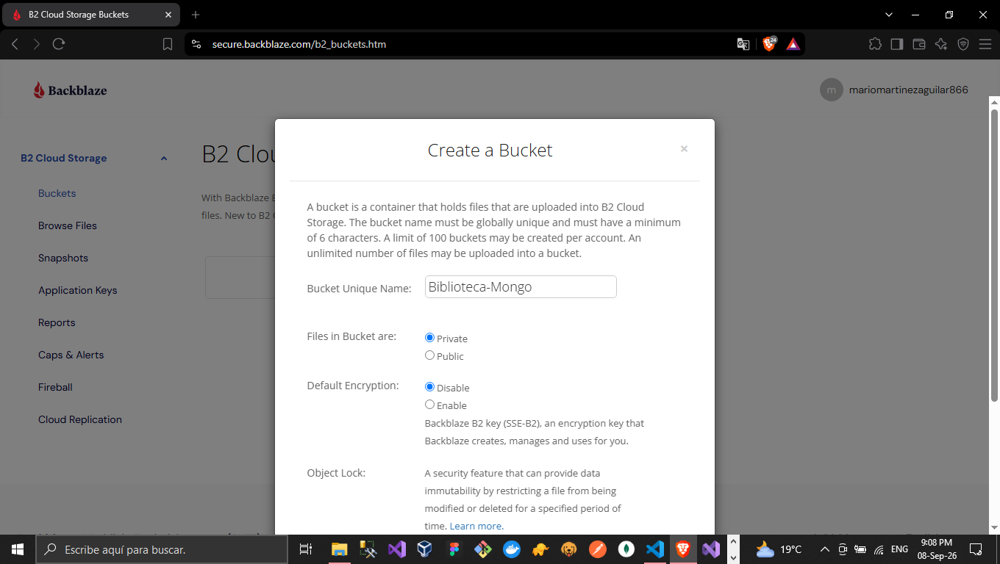

**Bucket listo para ser usado**
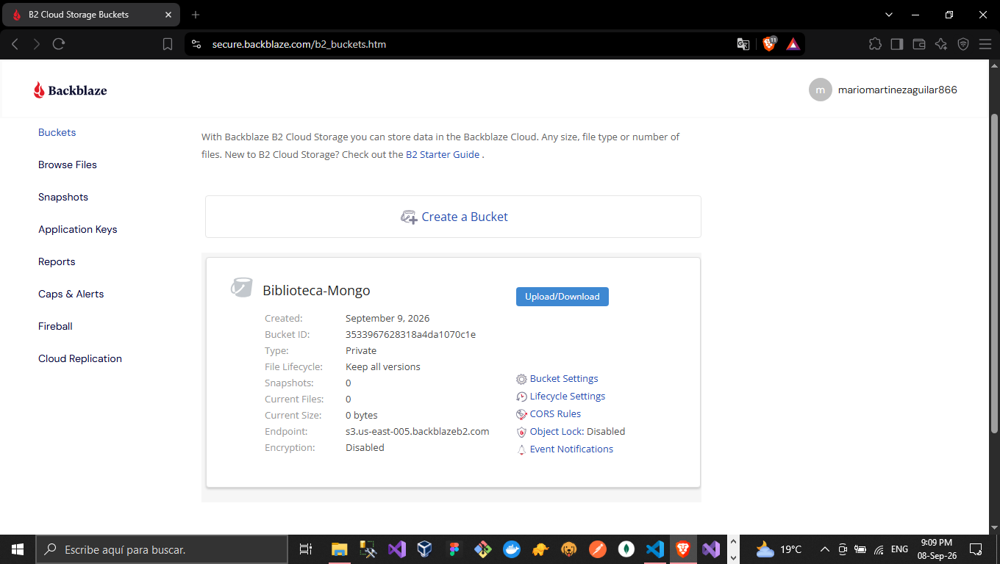

* **Generar las Llaves de Acceso:** En el menú ve a **Application Keys**, haz clic en **Add a New Application Key**, dale permisos de lectura y escritura (*Read and Write*) y copia tu **`Key ID`** y tu **`Application Key`** en un lugar seguro.

**Como podemos ver aquí asigne un nombre le di permisos de lectura y escritura ademas seccione el nombre de mi bucket le damos clic para que nos genere las llaves se aparecerá una ventana donde nos da las dos llaves solicitadas, a continuación muestra el momento en creo las llaves de acceso. Solo pondré el momento donde le di permisos y cuando la llave se creo correctamente no coloco mis llaves porque deben ser seguras para cada quien:**
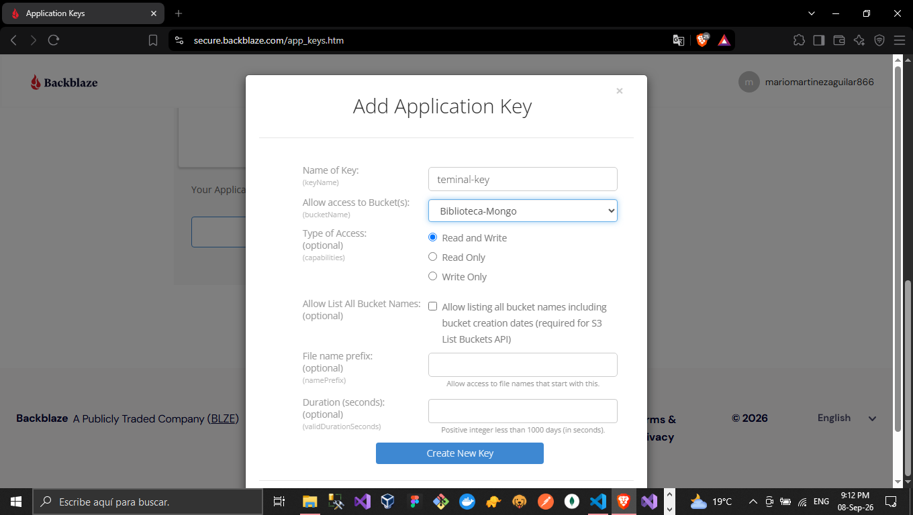

**Nuestras llaves creadas correctamente**
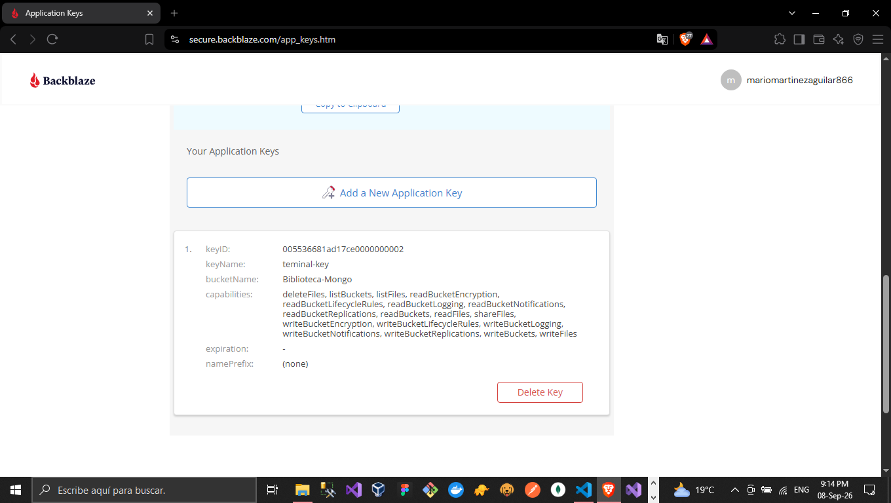

#### 💻 2. Configuración del CLI en la Consola (Hacer `b2` global):
**Para poder usar los comandos de Backblaze desde cualquier carpeta de la terminal, se realiza lo siguiente:**
1. Descarga el ejecutable `b2.exe`.
2. Muévalo dentro de la carpeta de herramientas de MongoDB que ya está en el Path del sistema:
   * Ruta: `C:\Program Files\MongoDB\Tools\100\bin`

#### 🚀 3. Pasos para realizar el respaldo por Consola:
**Ahora si vamos a realizar nuestro respaldo para mandarlo a la nube asi que primero:**

1. Inicia sesión en Backblaze desde tu terminal ejecutando tus credenciales (solo se hace la primera vez):
```bash
    b2 authorize-account <tu_Key_ID> <tu_Application_Key>
```
**Vemos como nos conectamos a la nube de Backblaze al ejecutar el comando nos tiene que dar la siguiente información de acceso:**
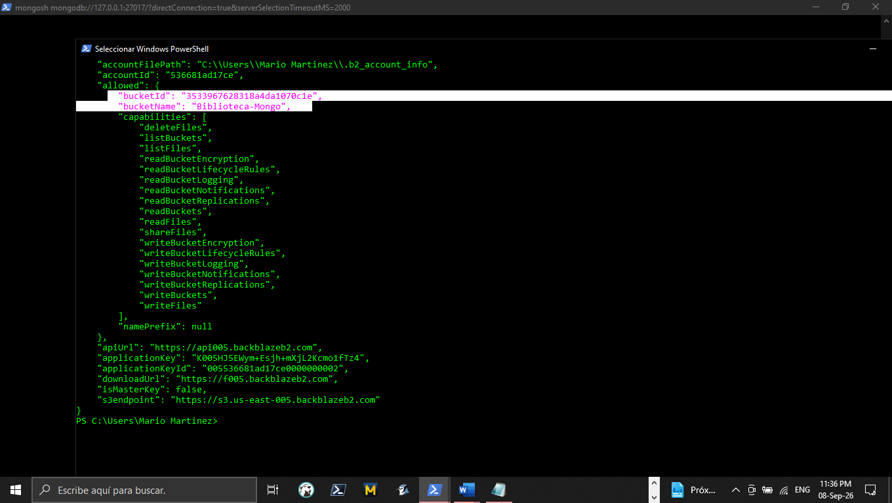

2. Genera el respaldo de MongoDB comprimido en un solo archivo único `.gz` a esto se le conoce como flags de optimización binaria aplicamos el comando con mongodump:
```bash
   mongodump --db Biblioteca --gzip --archive="./respaldo_biblioteca.gz"
```
**Vemos como empaquetamos nuestro respaldo para mandarlo a la nube:**
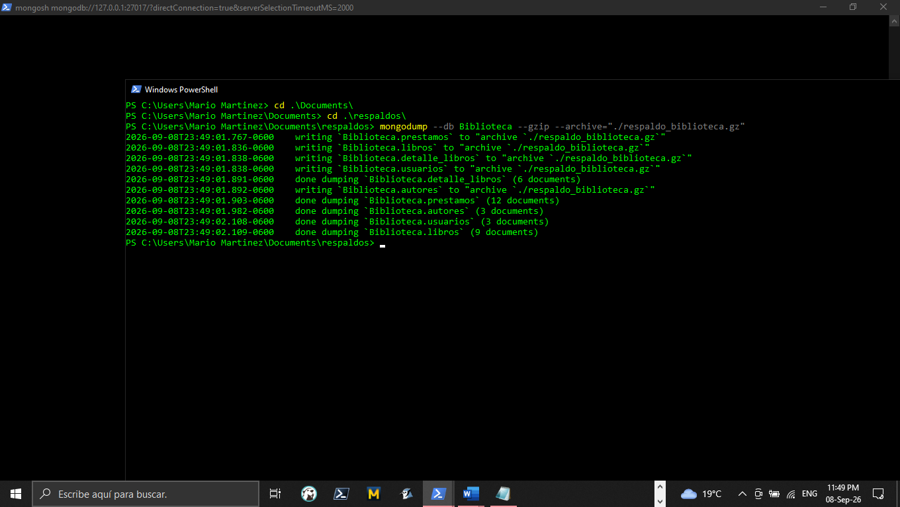

3. Sube tu archivo comprimido al contenedor de Backblaze ejecutando el comando de subida:
```bash
   b2 file upload Biblioteca-Mongo "./respaldo_biblioteca.gz" "respaldo_biblioteca.gz"
```
**Aquí ejecutamos el comando para subir nuestro respaldo comprimido a la nube:**
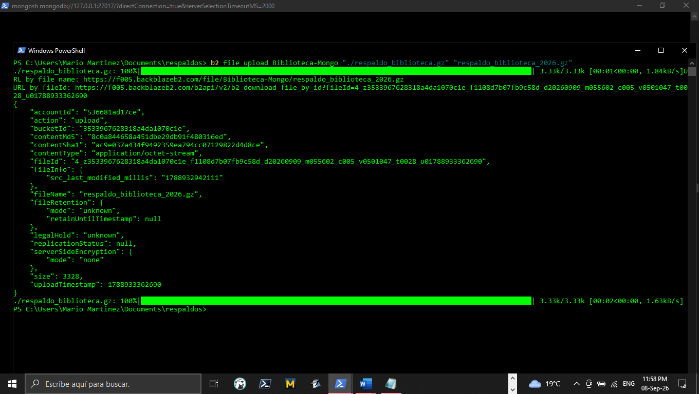

**Verificamos que nuestro respaldo comprimido ya este en la nube:**
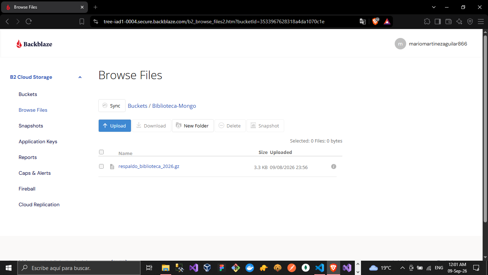

**Hicimos una prueba final real para ver si todo funciono correctamente, borramos la base  de datos simulando perder la información:**
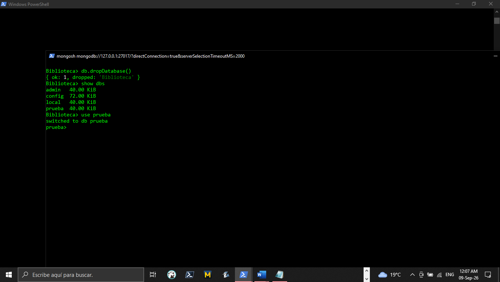

#### 🔄 4. Pasos para la Restauración desde la nube:
1. Descarga el archivo comprimido desde tu Bucket de Backblaze a tu computadora:
```bash
   b2 file download b2://Biblioteca-Mongo/respaldo_biblioteca.gz "./respaldo_descargado.gz"
```
**Vemos como se descarga nuestro respaldo lo traemos desde la nube:**
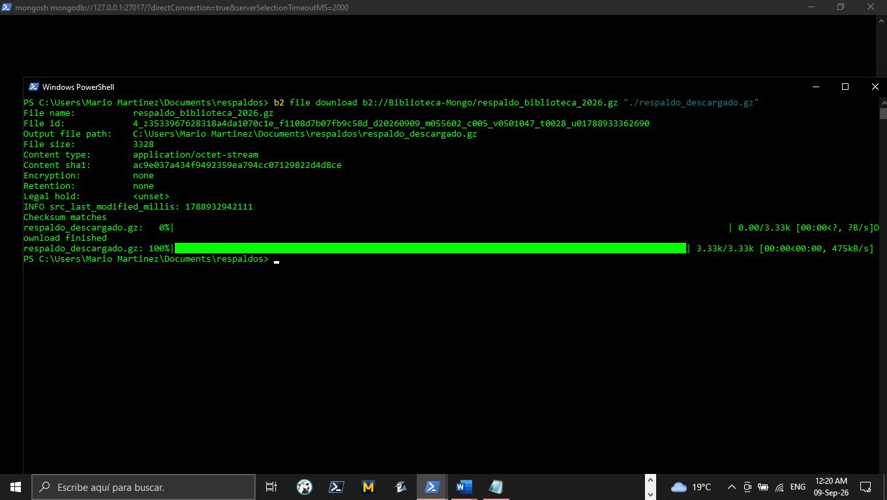

**Verificamos que se halla descargado el archivo comprimido:**
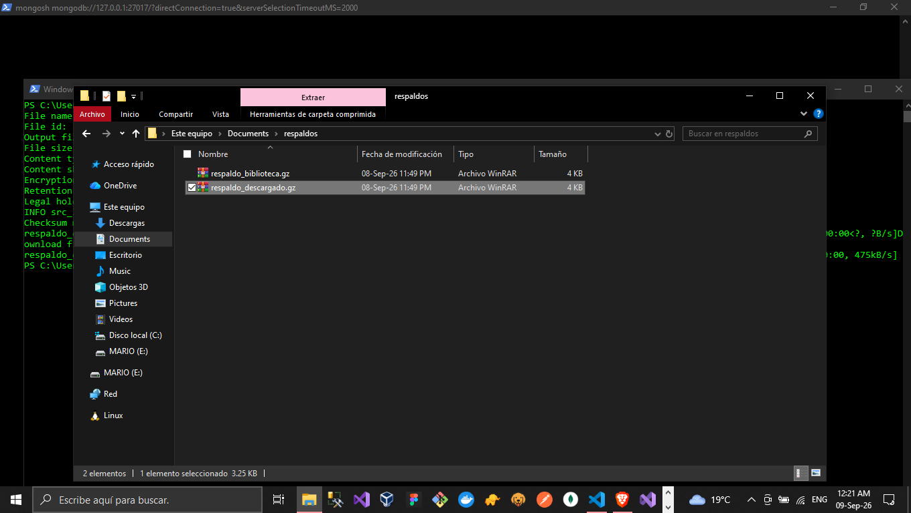

2. Aplica la restauración directa del archivo comprimido en tu MongoDB local usando `mongorestore`:
```bash
   mongorestore --gzip --archive="./respaldo_descargado.gz"
```

**Vemos como nuestra base de datos ya es restaurada nuevamente:**
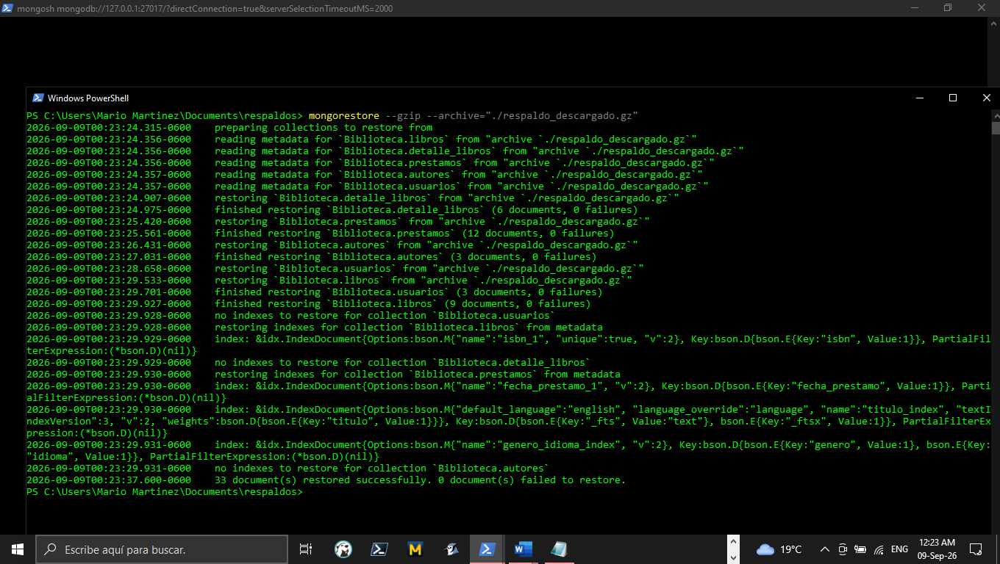

**Comprobación final vemos que nuestra base  de datos se restauro exitosamente:**


## 🤖 5. Automatización del proceso con Script de Windows (Opcional):
**Para facilitar el proceso diario, se creó un script ejecutable que comprime la base de datos y la sube a la nube de Backblaze de forma automática con un solo clic.**

1. Aquí en la carpeta `BACKUPS & RESTORE` del proyecto se encuentra el archivo `respaldar.bat` donde tiene las instrucciones precisas para realizar el respaldo para la nube puedes chocarlo y analizarlo.

2. Para ejecutar el respaldo automático, simplemente haz **doble clic** sobre el archivo desde el Explorador de archivos de Windows.

*Nota: El script utiliza comandos Batch y se encarga de mostrar el progreso en tiempo real hasta confirmar la subida al 100%.*

#### Vista previa del script realizado
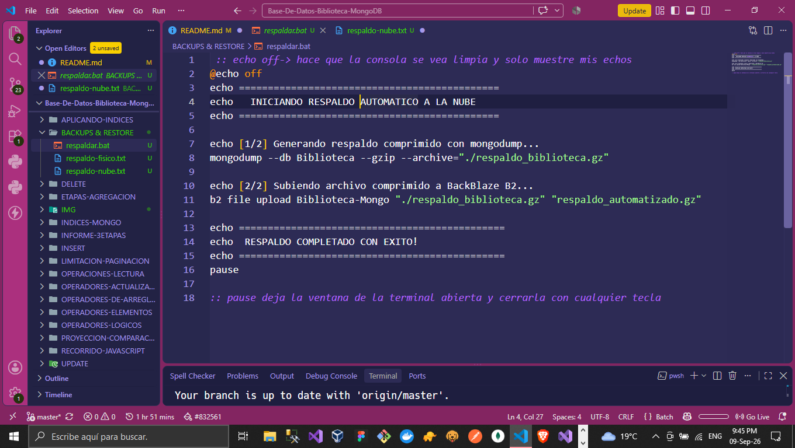

#### Vista previa de su funcionamiento a la hora de ejecutarlo
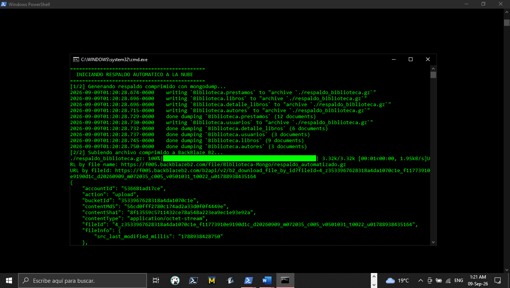

#### Vemos como hace todo el proceso automáticamente:
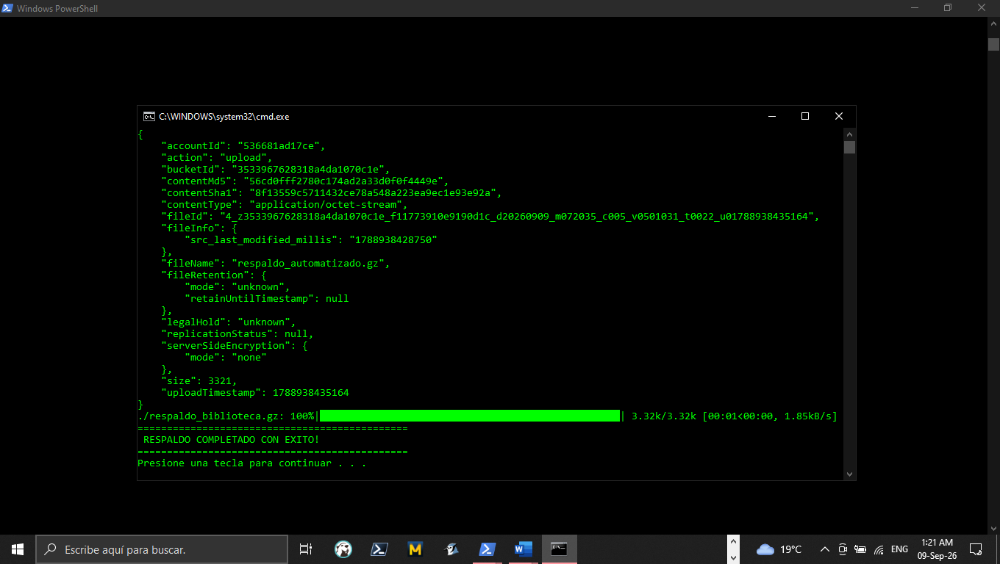

#### Finalmente comprobamos que nuestro respaldo si se sube automáticamente con ese script.
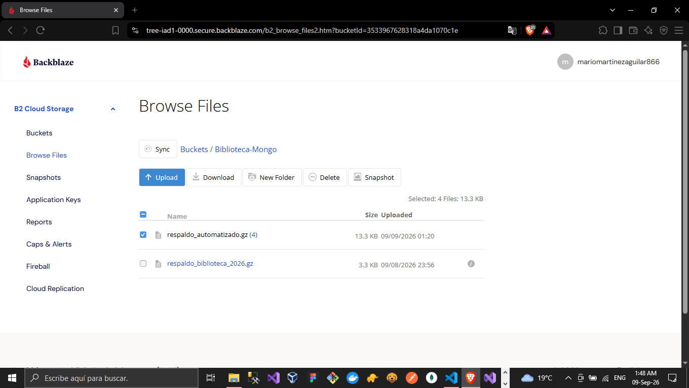


## 🔒 Seguridad y Autenticación en MongoDB (Local)
**Como parte de las buenas prácticas de infraestructura y protección de datos, la base de datos local fue configurada para operar bajo un entorno seguro, restringiendo el acceso abierto por defecto  e implementando el control de accesos por roles (RBAC).**

**Para realizar este proceso tenemos que seguir los siguientes pasos:**

### 👥 1. Creación del Usuario Administrador
**Se inicializó el sistema y, a través de la base de datos de control `admin`, se generó un superusuario con permisos totales de lectura, escritura y gestión de otros usuarios en todo el servidor: puedes encontrar todo el código para crear el usuario administrador en la carpeta `SEGURIDAD-MONGO` en su archivo `seguridad-mongo.js`, donde se explica a detalle parte de este proceso y los permisos asi como sus propiedades que debemos tener encuenta, a continuación colocare el script para crear el usuario administrador**

```JavaScript
   use admin

   db.createUser({
      user: "tu_usuario_admin",
      pwd: "tu_contraseña_segura",
      roles: [
         { role: "userAdminAnyDatabase", db: "admin" },
         { role: "readWriteAnyDatabase", db: "admin" }
      ]
   })
```
**Vista previa del usuario creado en MongoDB Compass:**
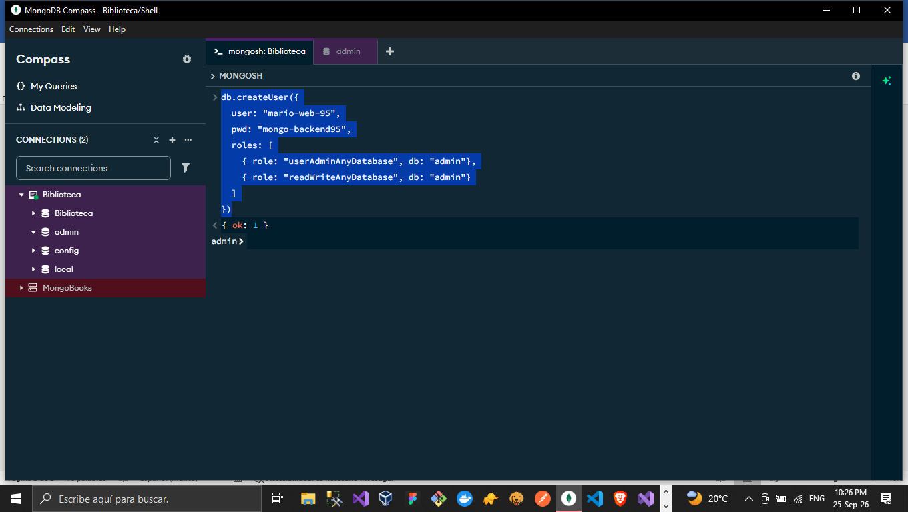

**Comprobando que nuestro usuario se creo correctamente con el comando `db.getUsers()`**
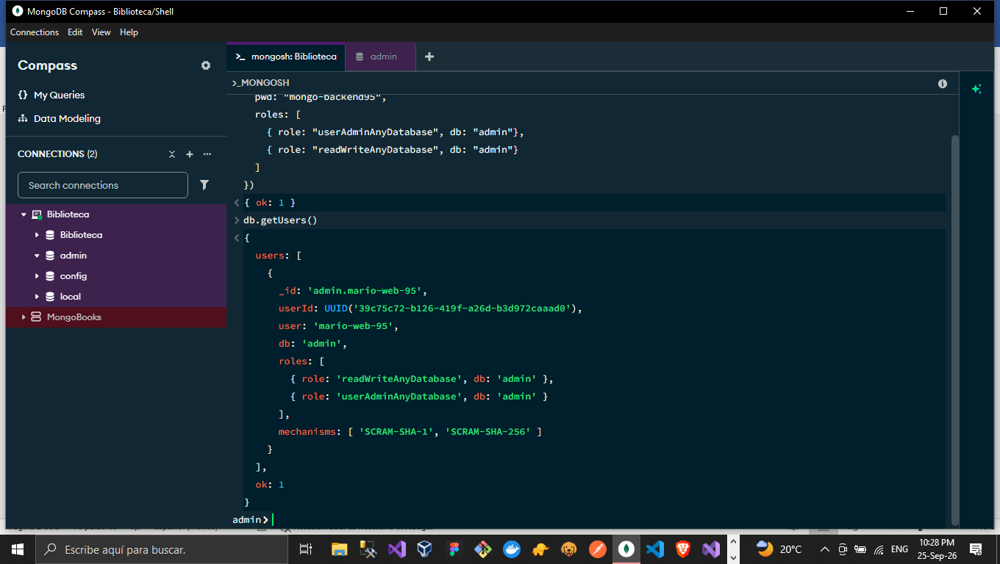

### 🔑 2. Activación del Candado de Seguridad (`--auth`)
**Para forzar a MongoDB a exigir credenciales en cada conexión y restringir accesos no autorizados, el servidor se inicializa utilizando el parámetro de autenticación:**

**Arrancamos el servidor de mongo con el candado de autenticación:**
```bash
   mongod --auth
```
**Arrancando el servidor con el candado de autenticación seguro**
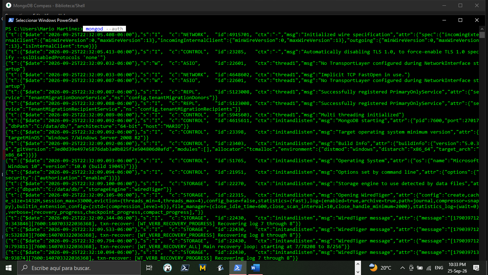

### 🔓 3. Conexión Segura al Servidor
**Una vez blindado el sistema, el acceso tanto visual como por terminal requiere la cadena de autenticación apuntando a la base de datos de origen (`admin`):**

**Primero nos conectaremos por la consola de comandos utilizando el siguiente comando:**
*   **Por Consola (Mongo Shell):**
    ```bash
      mongosh -u "tu_usuario_admin" -p "tu_contraseña_segura" --authenticationDatabase "admin"
   ```
**Vista previa de la conexión por consola de comandos cuando ejecutamos el comando anterior posteriormente nos pedirá la contraseña**

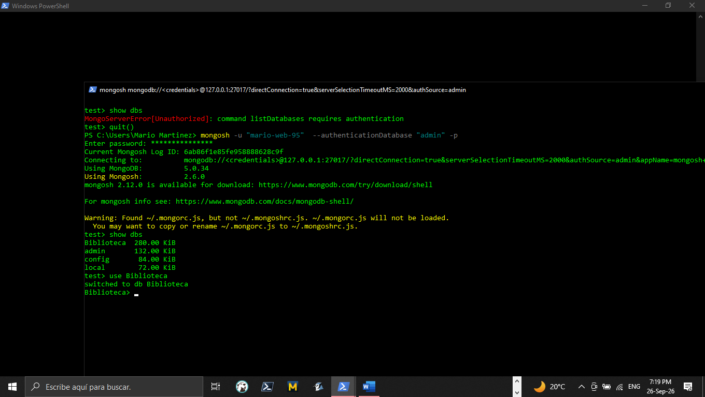

*   **Por Interfaz Visual (MongoDB Compass):** **Se configuró la sección *Authentication* en modo *Username / Password*, especificando el usuario, contraseña y definiendo `admin` como la *Authentication Database***.

**Vista previa de la conexión con interfaz gráfica de mongoDB Compass**
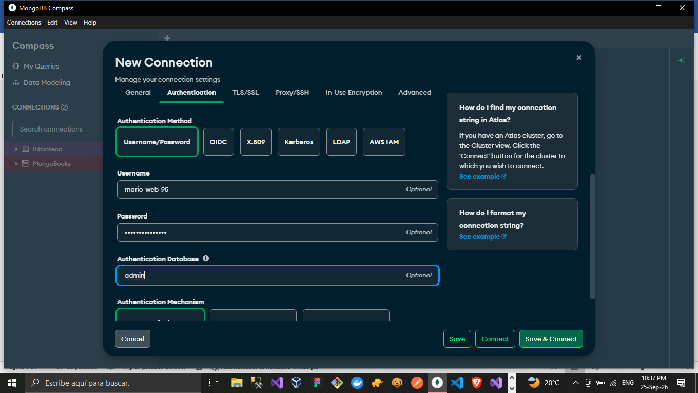

**Vemos que nos conectamos a las base de datos del servidor**
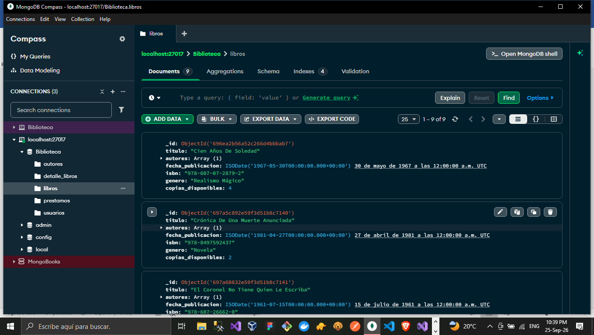


### Lista De Tecnologías, Propiedades De MongoDB Como Nuestro Servidor De Base De Datos Y Herramientas Usadas En Nuestro Proyecto(Base De Datos Biblioteca)  

1. MongoDB(Servidor De Base De Datos)
2. MongoDB Compass(Interfaz Visual De Mongo) 
3. MongoDBShell(Interfaz De Línea De Comandos)
4. Visual Studio Code
5. Primeros Comandos Mongo(mongod,mongo,mongosh,etc)
6. Creación De Bases De Datos(use)
7. Manejo E Implementación de Colecciones
8. Manejo Del Formato BSON
9. Comandos Para La Manipulación De Colecciones 
10. Comandos Para Manipular Documentos
11. Tipos De Datos En MongoDB
12. Esquemas Flexibles En MongoDB
13. Patrones De Modelado En MongoDB
14. Modelo De Relaciones Uno A Uno
15. Modelo De Relaciones Uno A Muchos
16. Modelo De Relaciones Muchos A Muchos
17. Operaciones De Creación INSERT
18. Operaciones De Lectura FIND
19. Implementando De Variables JavaScript En Mongo
20. Paginación Y Limitaciones De Resultados(limit y skip)
21. Operadores De Proyección($ $slice)
22. Operadores De Comparación($eq,$ne,$gt,$gte,$lt,$lte)
23. Operadores De Arreglos($elemMatch,$size,$all,$in y $nin)
24. Operadores Lógicos($and,$or,$nor y $not)
25. Operadores De Elementos($type,$exists) 
26. Operaciones De Actualización(UPDATE Y REPLACE)
27. Operadores de Actualización($set, $unset y $inc,$min,$addToSet)
28. Operaciones De Eliminación(DELETE Y REMOVE)
29. Índices En Mongo
30. Optimización De Consultas
31. Etapas De Agregación($match,$group y $sort)
32. Operadores De Acumulación($sum,$avg,$min y $max)
33. Pipeline De Agregación
34. Recorrido De Documentos(forEach)
35. Método De Cursor(pretty())
36. Método Count En Mongo
37. Aplicación De Los Tipos De Índices
38. Análisis Y Optimización De Consultas Con explain("executionStats")
39. MongoDump Respaldos
40. MongoRestore Restauración
41. Infraestructura Y Autenticación En La Nube Con Backblaze B2
42. Manejo De Scripts De Automatización Para Respaldos en Windows
43. Creación De Usuarios Y Administración De Roles
44. Seguridad Y Autenticación En MongoDB(auth)
43. Git-Hub

### *Elaborado Por: Mario Martínez Aguilar*


